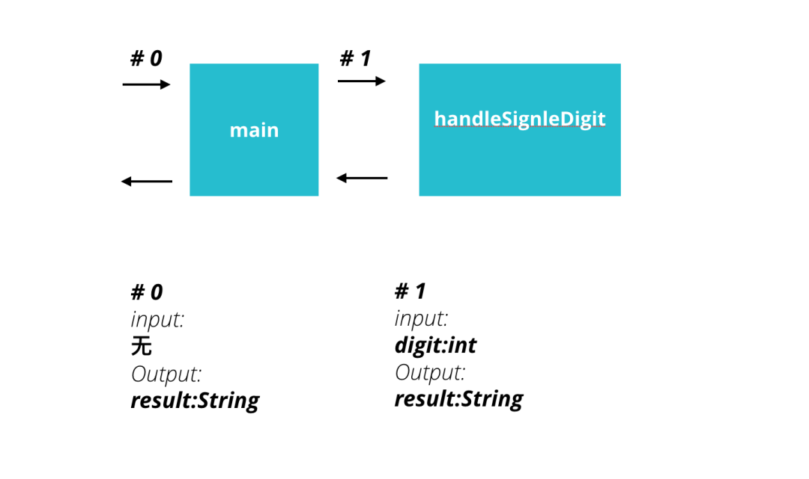
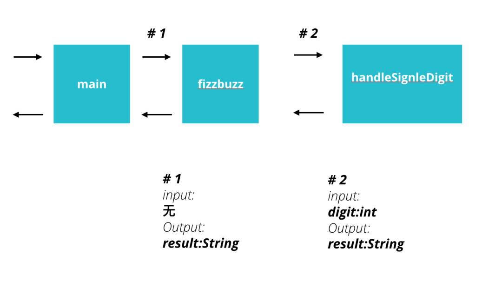
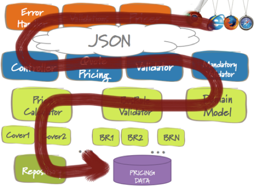
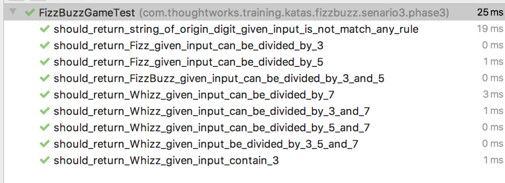
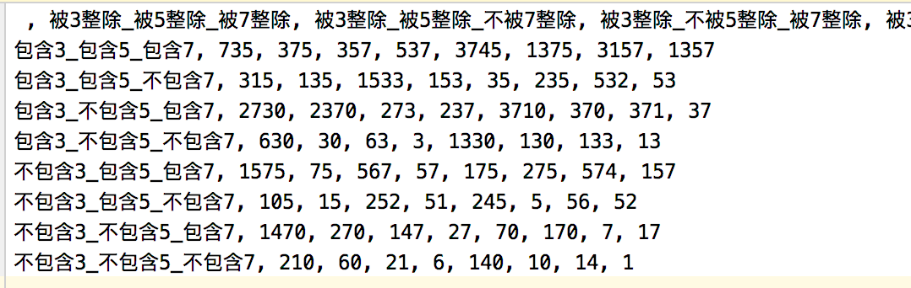

技术是由一万个细节组成的，哪怕一个这么简单的题目，也有如此多的点。我也不敢说自己是什么高手，起码写了许多年代码，也就把自己写代码的思维展示给大家，希望对有心人有所帮助。

非初学者向，虽然题是个简单的题，但要求读者有一定的敏捷工程实践及 DDD 相关经验。

FizzBuzz 是一个经典的 TDD 入门题目，麻雀虽小，五脏……勉强算全吧。Stack Overflow 创始人曾经在他的一本书里写到，“不要假设程序员都会写程序，招一个程序员来先写个 FizzBuzz 看看，结果可能会令你吃惊。”

我当时不信，于是在一个招聘活动上拿这个的一个完整版做了题目，结果也确实挺让我吃惊的，吃惊在哪我先卖个关子，后面详细说。后来教人写程序也用了这个题几百遍了，见识过各种各样奇怪的错误。

我们今天就用这个题目为例，来尽量阐述一些道理。这个题的需求有很多步，就好像软件开发中很多需求是一个版本一个版本迭代出来的，所以我们这个题目也一个迭代一个迭代来。

---

**迭代一**

迭代一的需求如下：

你是一名体育老师，在某次课距离下课还有五分钟时，你决定搞一个游戏。此时有 200 名学生在上课。游戏的规则是：

1. 让所有学生拍成一队，然后按顺序报数。
2. 学生报数时，如果所报数字是 3 的倍数，那么不能说该数字，而要说 Fizz；如果所报数字是 5 的倍数，那么要说 Buzz。

不同于凭本能思考，这里我们讲一个套路：我们做软件开发的时候可以刻意分三个问题域来考虑问题，我称之为业务域、方案域、实现域。这三个域有什么用呢？

当我们在进行软件开发的时候，有时会陷入无思路的状态，一旦陷入这种状态人容易焦虑，卡很久却没什么进展。这个时候我们往往是处于一种所谓的 unknown unknown 的状态。也就是不知道自己不知道什么。新人最容易陷入到这种状态，只好盯着屏幕看半天。这个时候就需要先意识到自己处于这个状态，然后就可以借用这三个域作为跳板跳出这个状态。

首先来看看你的问题到底在哪个域，在不同的域要采用不同的方法来探寻问题到底是什么，在这基础上就逐渐有了思路。这就是这三个域的用处。

具体怎么用呢？我们一个个来说。

#### **业务域**

首先说业务域，这里的业务用以代指需求。

以这个题为例，我们在读需求的时候会发现一个问题，被 3 整除返回 Fizz，被 5 整除返回 Buzz，被 3 和 5 整除返回什么？

这个问题很明显，就属于业务域的问题。

那么业务域的问题，我们通常怎么处理呢？

有的同学就直接脑补了：

- 脑补一：能被 3 和 5 整除，那就是先被 3 整除呗，那就 Fizz。
- 脑补二：能被 3 和 5 整除，那就返回 FizzBuzz 呗。

那么以上哪个脑补是对的呢？

**答案是以上都不对，脑补本身就不对，脑补只是猜测，猜测不经验证就是伪需求。当我们遇到业务域的问题，不要自己脑补，请去与需求方确认需求。**

（题外话：当然，你带着两个脑补去找需求方是可以的，甚至于是很好的，因为这样需求方就能更容易的听懂你的问题，比你问被 3 和 5 整除返回什么要更具体。这个题目里被 3 和 5 整除是很清楚的，但在工作中，提一个抽象的问题，然后跟上两个可能的具体的解决方案也能帮助对方理解。）

确认需求时最重要的就是对概念的理解建立共识，识别概念的边界。前者还好，后者容易疏忽，同一个名词即便在需求当中，由于上下文的不同也有可能指的是两个概念，这部分内容本篇不作详细讨论。

经过业务域的确认，我们得到了一个完善后的需求。

你是一名体育老师，在某次课距离下课还有五分钟时，你决定搞一个游戏。此时有 200 名学生在上课。游戏的规则是：

1. 让所有学生拍成一队，然后按顺序报数。
2. 学生报数时，如果所报数字是 3 的倍数，那么不能说该数字，而要说 Fizz；如果所报数字是 5 的倍数，那么要说 Buzz。
3. 学生报数时，如果所报数字同时是两个特殊数的倍数，也要特殊处理，比如 3 和 5 的倍数，那么不能说该数字，而是要说 FizzBuzz。

#### **方案域**

方案域就是想想代码写完之后什么样，我们这里讲一个简单的，我称之为上下文图。

上下文图表达的是代码的静态关系。比如，如果我的代码要这么写：

```java{4}
public class FizzBuzzGame {
    public static void main (String[] args) {
        for (int i = 1; i <= 200; i++) {
            String result = handleSingleDigit(i);
            System.out.printIn(result);
        }
    }

    public static String handleSingleDigit (int digit) {
        String result = "";
        if (digit % 3 == 0 && digit % 5 == 0) {
            result = "FizzBuzz";
        } else if (digit % 3 == 0) {
            result = "Fizz";
        } else if (digit % 5 == 0) {
            result = "Buzz";
        }
        if ("".equals(result)) {
            result = String.valueOf(digit)
        }
        return result;
    }
}
```

那图就是这么画的：



如果代码要这么写：

```java{3, 8}
public class FizzBuzzGame {
    public static void main (String[] args) {
        fizzBuzz();
    }

    private static void fizzBuzz () {
        for (int i = 1; i <= 200; i++) {
            String result = handleSingleDigit(i);
            System.out.printIn(result);
        }
    }

    public static String handleSingleDigit (int digit) {
        String result = "";
        if (digit % 3 == 0 && digit % 5 == 0) {
            result = "FizzBuzz";
        } else if (digit % 3 == 0) {
            result = "Fizz";
        } else if (digit % 5 == 0) {
            result = "Buzz";
        }
        if ("".equals(result)) {
            result = String.valueOf(digit);
        }
        return result;
    }
}
```

那么图就是这么画的：



整个这个画图的过程，是对程序的一个拆解，这个拆解的过程实际上也是伴随着设计的。这个图的主要目的就是画出一个一个只有数据依赖、没有过程依赖的小型的上下文。

什么叫过程依赖？如下所示：

```java{7, 11, 15}
// 经常有人把代码写成这样
public class FizzBuzz {
    public static void main (String[] args) {
        for (int i = 1; i <= 100; i++) {
            if (i % 15 == 0) {
                System.out.printIn("FizzBuzz");
                continue;
            }
            if (i % 3 == 0) {
                System.out.printIn("Fizz");
                continue;
            }
            if (i % 5 == 0) {
                System.out.printIn("Buzz");
                continue;
            }
            System.out.printIn(i);
        }
    }
}
```

上面的代码每一段 if 的逻辑执行完都调用了一个 continue（类似的还有 break 和 return），这使得每一个 if 的 block 都是与外面的 for block 耦合的，我无法单独把其抽取成一个函数。也就没法单独测试，它的可测试性一点都不高。

如果我不把程序拆成只有数据依赖没有过程依赖的小型上下文，那么无论是从调试还是测试的角度都会变得很复杂，因而实现也会变得复杂。

这段程序另一个可测试性差的地方在于直接输出到了标准输出流里，如果标准库没有给我们提供打桩的方法，那么这个程序就只能人肉测。即便提供了，测试成本也提升了，远不如直接测一个字符串来的容易。所以我们在考虑输入输出的时候，也要考虑输入是否容易准备、输出是否容易获得。

比起画上下文读这个图，得到可测试性高的程序设计，这个状态才是我们想要的。当你有足够多的经验后，其实你并不需要画这么简单的一个图，但是你脑子里还是会浮现出这样的结构，按这样的方式去思考程序，我们的目的就达到了。

当我们得到一个可测试的程序设计后，最后再理清一下，看看每个小型限界上下文的输入和输出，考虑输出的每个数据项是否都能从输入中得到所有的计算因子。如果这一步做不好，那么下层实现域实现的时候就会没思路。

#### **实现域**

- **任务列表**

从方案域落到实现域的第一步是得到实现域所需的任务列表。

从图落到实现还是有些变化，我们的图实际上有点像 Inception 当中的用户故事地图。用户故事地图是站在用户使用软件的角度列出软件有什么功能。但是软件毕竟还是需要一步一步做出来。所以上面的故事卡，还要重新搬到看板上去，变成看板上的任务卡，按照实现的角度排列顺序调整优先级，并且补充相应的技术卡等卡片。

同理，上下文图也需要经过这样一次映射转化为任务列表。任务列表并不跟上下文图里的图一一对应。就是说我有一个技术不会，我可能要查一查，这也是一个任务。查完之后要做一个试验验证，确定我想要的方式能实现，这也是一个任务。试验完了之后，在真实的产品代码中使用这个技术把需求实现出来也是一个任务。通常我们把任务就分为这几类：沟通协调（技术类的，非需求类的）、技术调研、原型测试、编码实现。随着团队的配合度越来越高，技术越来越熟悉，前三个就会越来越少，任务就会越发趋向于更多的编码实现。

- **TDD**

在编码实现方面，我们前面在做方案域设计的时候，已经把程序设计的可测试性很高，所以很自然我们在落地实现的时候，就可以通过打印的方式肉眼调试，随着我们代码越来越多，每写完一段新的代码块，应该就考虑把所有的都打印出来看看有没有变化，这就叫回归。而用肉眼看的方式做人肉回归实在是效率太低，频率也不会高。我们需要把肉眼看转换为自动化的方式，这就是自动化测试。既然我们可以通过自动化测试的方式来进行回归，校验的输入输出在开始之前也已经分析清楚了，那不妨在开始写代码之前就先把测试写出来，于是就得到了 TDD。

很多人抱怨 TDD 学不会，其实据我观察，大部分学生之所以不能使用 TDD 的方式写代码，核心原因还是不会把程序从输入输出角度进行拆解。一旦拆解开了，后面的就简单了。

我也发现在编程的时候，很多问题不是智力问题，而是心理问题。

我看见很多同学很喜欢一口气写一大堆代码，然后慢慢调试。如果他们真的有过人的才能，可以一次性写对，我觉得也没什么。然而事实是并不能，反而浪费很多时间。

究其原因还是不会改程序，所以想着一次性写好，为什么这么说呢？你会发现他们基本上不考虑输入输出的具体格式，脑子里有一个模模糊糊的感觉，就开始写实现了，到实现完为止，程序都执行不起来，执行起来之后，因为函数已经很长了，中间出了错误，准备数据也不好准备，于是要改半天，于是更害怕执行了，于是更想一次性写好，函数就更长了。

由于不会思考输入输出，也就不会拆子函数，因为大的都没好好想，小的子函数就更别说了，函数的输入输出没有分析清楚，拆了子函数因为作用域的问题没想清楚，所以想一个函数写完。或者乱拆了子函数，然后就开始各种加全局变量。总之就是因为不敢改，所以把犯错的范围越积越大，故障点越垒越多。越是这样就越不敢执行。因为一执行就更肯定是报错的，一旦查错呢，因为代码太长又害怕查错查的把写代码的思路忘了，于是又强化了一次性写完的行为。

整个这套我们称之为基于本能的行为模式并不是一个理性的结果，反而是一个感性的结果。所以我们教的这些实践并不是单纯的解决智力问题，相当多的部分也是在解决心理问题。

与这套基于本能的行为模式相反，我们教的这套以 TDD 思想为核心的行为模式，有意识把代码拆成小块，自然可以小步试错，可以小块验证，也就可以保证实现的过程中即便出了问题也可以快速的定位。哪怕不写测试，你打印也比别人调试快，单步调试也知道每一块干什么，另一块跟这个不相关，就可以快速跳过，到了你关心的部分，分析过输入输出，也就能更快速的知道哪里错了。**所以不能从输入输出角度进行思考是人们没有办法写出高质量程序的一个原因。**

而每一块的编码实现我们还是会再分任务，以本问题单个数的转换为例，接口是非常清楚的——输入是个整数，输出是个字符串。

但是你实现的过程要分几步。

我要先实现可以被 3 整除的，再实现可以被 5 整除的，最后实现可以被 3 和 5 整除的，这算是一个驱动的意思。从简单的入手，然后再往复杂的去写。很多人可能会觉得比较无聊。但如果你测试的人足够多，你会发现很多人哪怕是在这样一个无聊的题上，也会把自己坑进去。举个例子我们第 3 步：可以被 3 和 5 整除。当我们实现的时候，我们 if 里那个表达式模 3 模 5 在上还是在下。每次我都会故意写在下面问有没有问题，如下图所示：

```java{8}
public static String handleSingleDigit (int digit) {
    if (digit % 3 == 0) {
        return "Fizz";
    }
    if (digit % 5 == 0) {
        return "Buzz";
    }
    if (digit % 3 == 0 && digit % 5 == 0) {
        return "FizzBuzz";
    }
    return String.valueOf(digit);
}
```

每次都会有人意识不到。这么简单的题目都会被绕晕，到底要多有自信，才会觉得复杂的需求不会出错呢？所以还是老老实实的给自己加测试防护网吧。测试一个很重要的原则，是防止低级错误，而不是恶意欺骗。

**先确认需求，再实现，需求以测试的形式写出来，然后再去实现，这就是 TDD 了。** 如果实现的时候只需要关注其中一种可能性，这样思维负担比较轻。如果你脑力强劲，觉得步子大一点没事，你就步子大一点，我是没有此等自信。有些人问我，TDD 的时候测试有没有阶段性，测试是否有要分批写？我大概会分三批：

- 第一批测试只有一个测试，意义是：定义输入输出，确定函数在哪。
- 第二批测试的意义是：建立主干框架，把程序的主干走通。
- 然后再写第三批测试，把各种分支和异常都考虑到。

这样写出来的程序就是一个比较健壮的程序。反过来看，当你时间不够的时候。你要减的测试是哪个？肯定是第三批测试，不是整组干掉，而是在这组当中减少量。有很多人会说自己没有时间写测试，或者说测试很浪费时间。但是如果你打开代码的时候，发现前两组测试都不存在，就很说不过去了，因为前两组几乎不花什么时间。而且如果做得好还会提高效率，减少时间花费。一个最简单的道理，当我有一天出了 bug，我能以多快的速度建立一个可运行的程序现场，以多短的周期反复重现这个 bug，并且对新解决方案进行尝试，决定了修 bug 的速度。前两组测试完全可以为这个场景服务，而这个场景不完全发生在测试测出来 bug，在我们日常写代码的时候，我们不能保证我们写的代码是一次就能写对的，那么在没有写对之前就等于代码中存在了 bug，也是要反复调试的，那这个对实验的周期时间的要求是一样的。有那个调试的功夫，直接看测试不是一样吗？

- **过度设计**

到此为止，我们写出来带的代码如下所示：

```java
private static void fizzBuzz () {
	for (int i = 1; i <= 200; i++) {
        String result = handleSingleDigit(i);
        System.out.printIn(result);
    }
}

public static String handleSingleDigit (int digit) {
    if (digit % 3 == 0 && digit % 5 == 0) {
        return "FizzBuzz";
    }
    if (digit % 3 == 0) {
        return "Fizz";
    }
    if (digit % 5 == 0) {
        return "Buzz";
    }
    return String.valueOf(digit);
}
```

实现并不复杂，仔细看看这代码还可以，够用，不难懂，那就行了，我们就先不请重构登场了。天下设计都讲究一个不要过度设计，软件设计也不例外，做到这里是很好懂的，那我们也不要画蛇添足。

很多人一看到可能的扩展点，就想了一大堆可能的需求，再有个 9 呢？或者是所有的素数，比如 11 啊，13 啊……

这方面我们要有耐心一点，比起可能降临的扩展给我们带来的困扰，我们自己乱添加的扩展机制更可能会坑死自己。

有个段子是这么讲的，有个人请来了一个新手，一个老手，一个高手，给他们布置了一个任务，穿过一片农田到对面的房子去，这片农田就隐喻我们的代码，问要多长时间。

新手看了一眼距离说估计 15 分钟就能过去。老手看了一眼，说要半天。高手也看了一眼，说 15 分钟。新手进到农田，不停的掉到坑里，踩爆了几个雷，最后被埋在田里了。老手小心翼翼，过程中填了几个坑，排了几个雷，花了半天的时间，终于到达了房子。发现高手早就已经在那儿等了他很久了。老手不解，问为什么你可以这么快？你怎么干掉那些雷的？高手说，因为从一开始我就没有埋雷。

这个段子告诉我们，程序员自己给自己埋的雷往往会成为未来的负担，好的程序员会尽量少的给自己埋雷。这所谓的雷，可能一开始就是一个精心设计的机制。

不要以为这只是一个段子，在曾经工作的一个项目上，我接了一个特别简单的任务，以为一会儿就能做完，打开代码之后，我发现之前的代码竟然是用反射机制设计的一个极其复杂的扩展机制。为了搞懂这个机制，我竟然花了一个礼拜。最后我觉得这个机制实在不利于扩展，我现在对它知根知底，为了防止后人再进这个坑，我就把它删掉了。删之前我就很好奇，这么复杂的机制，有没有起到易于扩展的作用啊，于是我就打开版本控制的历史记录，我发现他是两年前添加的，在过去的两年之中，从来没有进行过一次扩展，直到今天被我删掉。想想也对，这么复杂的代码，别人读都读不懂，为什么会选择在这儿扩展呢？所以不要盲目追求易于扩展的设计，绝大多数时候刚刚好的设计才是最好的设计。

---

**迭代 2**

前面的做完，新的需求来了：

你是一名体育老师，在某次距离下课还有五分钟时，你决定搞一个游戏。此时有 200 名学生在上课。游戏的规则是：

1. 让所有学生拍成一队，然后按顺序报数。
2. 学生报数时，如果所报数字是 3 的倍数，那么不能说该数字，而要说 Fizz；如果所报数字是 5 的倍数，那么要说 Buzz；如果所报数字是第 7 的倍数，那么要说 Whizz。
3. 学生报数时，如果所报数字同时是两个特殊数的倍数情况下，也要特殊处理，比如 3 和 5 的倍数，那么不能说该数字，而是要说 FizzBuzz, 以此类推。如果同时是三个特殊数的倍数，那么要说 FizzBuzzWhizz。

迭代 2 的需求改动不多，这个需求对我们的业务域造成的变化是加入了一个新的特殊数字 7。如果我们还是按照迭代 1 的方式去实现，我们写出来的代码可能很可能如下所示：

```java{10, 13, 16, 19, 22, 25, 28, 30}
public static void fizzBuzz() {
    for (int i = 1; i <= 200; i++) {
        String result = handleSingleDigit(i);
        System.out.printIn(result);
    }
}

public static String handleSingleDigit (int digit) {
    if (digit % 3 == 0 && digit % 5 == 0 && digit % 7 == 0) {
        return "FizzBuzzWhizz";
    }
    if (digit % 5 == 0 && digit % 7 == 0) {
        return "BuzzWhizz";
    }
    if (digit % 3 == 0 && digit % 7 == 0) {
        return "FizzWhizz";
    }
    if (digit % 3 == 0 && digit % 5 == 0) {
        return "FizzBuzz";
    }
    if (digit % 3 == 0) {
        return "Fizz";
    }
    if (digit % 5 == 0) {
        return "Buzz";
    }
    if (digit % 7 == 0) {
        return "Whizz";
    }
    return String.valueOf(digit);
}
```

代码有什么问题吗？它最大的问题叫做圈复杂度太高。

#### **圈复杂度**

圈复杂度的计算方式是这样的，每当你看到一个 for 或者 if 或者 while，总之，每看到一个判断分支或者是一个循环分支，圈复杂度就加 1。每当看到 continue 和 break 也加 1，return 也加 1。加完了就是这一部分代码的圈复杂度了。

圈复杂度高了会怎么样呢？圈复杂度高低与 bug 率高低有强相关性。在各种测试指标当中，很少有像圈复杂度这样与千行代码 bug 率强相关的指标，相关度高达百分之九十几。也就是每千行代码，圈复杂度越高 BUG 率就越高。虽然不是因果性，但是对于一个工程学科来说，相关性也有足够多的指导意义了，所以当我们看到圈复杂度比较高的代码的时候，就要考虑重构掉。

#### **重构与十六字箴言**

这回我们就真的需要重构了，具体重构要怎么做呢？难道是把这块删了重写吗？那就有点糙了。但精细的讲，重构是有 60 多种手法的，也没谁都能记住啊。不过好在总的来说手法的模式是很相近的，我们有个同事总结了四句话，我们戏称为“16 字箴言”，内容如下：

- 旧的不变
- 新的创建
- 一步切换
- 旧的再见

什么意思呢？首先不要着急改掉旧的代码，先让旧的保持不变，不过因为 IntelliJ 这种利器的存在，使得抽取函数本身不再是一件危险的事（起码在 Java 里是这样），所以我们通常会先把要重构的旧的代码抽个函数，让重构的目标显性化。做这一步的时候，你会发现可能已经要改变代码结构了，起码要改造成我前面所说消除过程依赖，让代码之间只有数据依赖，这样才好提取嘛。提取之后写个新实现，然后在调用点调用新实现，旧的调用点先注释掉，测试通过了，在把旧的调用点代码删掉，打扫战场把旧的实现也删掉。

具体到这个题呢，我的做法会是如下：

先消除过程依赖。

```java{9}
public static void fizzBuzz() {
    for (int i = 1; i <= 200; i++) {
        String result = handleSingleDigit(i);
        System.out.printIn(result);
    }
}

public static String handleSingleDigit (int digit) {
    String result = ""
    if (digit % 3 == 0 && digit % 5 == 0 && digit % 7 == 0) {
        result = "FizzBuzzWhizz";
    } else if (digit % 5 == 0 && digit % 7 == 0) {
        result = "BuzzWhizz";
    } else if (digit % 3 == 0 && digit % 7 == 0) {
        result = "FizzWhizz";
    } else if (digit % 3 == 0 && digit % 5 == 0) {
        result = "FizzBuzz";
    } else if (digit % 3 == 0) {
        result = "Fizz";
    } else if (digit % 5 == 0) {
        result = "Buzz";
    } else if (digit % 7 == 0) {
        result = "Whizz";
    }
    if (result.equals("")) {
        result = String.valueOf(digit);
    }
    return result;
}
```

然后抽取函数，把要重构的代码块先通过函数封起来，划定重构的边界，把输入输出浮现出来。

```java{2}
public static String handleSingleDigit (int digit) {
    String result = handleMod357(digit);
    if (result.equals("")) {
        result = String.valueOf(digit);
    }
    return result;
}

private static String handleMod357 (int digit) {
    String result = "";
    if (digit % 3 == 0 && digit % 5 == 0 && digit % 7 == 0) {
        result = "FizzBuzzWhizz";
    } else if (digit % 5 == 0 && digit % 7 == 0) {
        result = "BuzzWhizz";
    } else if (digit % 3 == 0 && digit % 7 == 0) {
        result = "FizzWhizz";
    } else if (digit % 3 == 0 && digit % 5 == 0) {
        result = "FizzBuzz";
    } else if (digit % 3 == 0) {
        result = "Fizz";
    } else if (digit % 5 == 0) {
        result = "Buzz";
    } else if (digit % 7 == 0) {
        result = "Whizz";
    }
    return result;
}
```

接着写一个新函数。

```java{9-21}
public static String handleSingleDigit (int digit) {
    String result = handleMod357(digit);
    if (result.equals("")) {
        result = String.valueOf(digit);
    }
    return result;
}

private static String handleMod357New (int digit) {
    String result = "";
    if (digit % 3 == 0) {
        result += "Fizz";
    }
    if (digit % 5 == 0) {
        result += "Buzz";
    }
    if (digit % 7 == 0) {
        result += "Whizz";
    }
    return result;
}
```

然后把函数调用点换掉。

```java{2,3}
public static String handleSingleDigit (int digit) {
    String result = handleMod357New(digit);
//    String result = handleMod357(digit);
    if (result.equals("")) {
        result = String.valueOf(digit);
    }
    return result;
}
```

然后把旧的函数删掉，打扫现场，该改名改名，该去注释去注释。

```java{3-11}
public static String handleSingleDigit (int digit) {
    String result = "";
    if (digit % 3 == 0) {
        result += "Fizz";
    }
    if (digit % 5 == 0) {
        result += "Buzz";
    }
    if (digit % 7 == 0) {
        result += "Whizz";
    }
    if (result.equals("")) {
        result = String.valueOf(digit);
    }
    return result;
}
```

上面每一步结束的时候都要保证测试是通过的。软件工程当中有一句很重要的理念：一个问题发现的越晚修正它的成本就越高。本着这个思想，我们重构的时候也要是这个样子，每做一次修改都要看一看有没有问题，如果有问题就立刻修正。如此小步前进，才是我们所谓的重构。

一旦你重构掉之后，有一天你想看看原始实现是什么样子。或者干脆你就想切换回原始实现。这个时候这一步切换可以最大限度的保留当时的代码全景，让你很容易的看清当时的实现，也让你的回滚变得容易，毕竟谁也不敢保证自己能一次性做对，改着改着发现低估了这个复杂性，还不如以前的设计方便，也是常有的事儿。

---

**迭代 3**

你是一名体育老师，在某次距离下课还有五分钟时，你决定搞一个游戏。此时有 200 名学生在上课。游戏的规则是：

1. 让所有学生拍成一队，然后按顺序报数。
2. 学生报数时，如果所报数字是 3 的倍数，那么不能说该数字，而要说 Fizz；如果所报数字是 5 的倍数，那么要说 Buzz；如果所报数字是第 7 的倍数，那么要说 Whizz。
3. 学生报数时，如果所报数字同时是两个特殊数的倍数情况下，也要特殊处理，比如 3 和 5 的倍数，那么不能说该数字，而是要说 FizzBuzz, 以此类推。如果同时是三个特殊数的倍数，那么要说 FizzBuzzWhizz。
4. 学生报数时，如果所报数字包含了 3，那么也不能说该数字，而是要说相应的单词，比如要报 13 的同学应该说 Fizz。
5. 如果数字中包含了 3，那么忽略规则 2 和规则 3，比如要报 35 的同学只报 Fizz，不报 BuzzWhizz。

到这个版本，就是我们拿去做面试题的版本了，揭晓前面吃惊的地方，明明没有说包含 5 和包含 7，结果有近 1/3 的人自己就写了包含 5 直接返回 Buzz，包含 7 直接返回 Whizz。还有一部分人走向脑补的反面，我们权且叫它脑删，比如这个题就是明明写了包含 3，他没做，这种情况也都在那 1/3 里。

同学们，我需要再强调一遍，脑补是不对的。我去很多学校进行过人才的筛选，我发现一个基本的标准就可以筛掉大多数的人，那就是这个人会不会脑补或者脑删。这个比例有多高，恐怕高出你的想象。有一个研究贫困家庭到底会在学习上遇到什么问题的书里讲，贫困家庭的孩子，最大的能力缺失是阅读能力不行，由于在小时候缺乏了阅读能力的锻炼，绝大多数穷人家的孩子阅读能力都不好，他们不习惯看长文，阅读也经常会理解错误，于是导致了他们的收入的天花板。

从这几个独立的案例里可以看到一个道理，那就是机器的输入输出很重要，人的输入输出同样重要，有的时候很多人并不是比别人笨，只是因为输入出了问题，智商的部分根本没有机会参与竞争。对于这些没过的同学，他们的问题就出在了题没有读清楚。也就是我们前面讲的业务域没搞清楚，所以最后结果不好。

我们当然也可以说，是你需求没有讲清楚，里面的重点没有标记清楚，没有用一种更容易理解的方式来呈现。但现实中真的存在完全清楚的需求描述吗？由于人类的语言存在强烈的上下文相关性，同一个词语换了上下文都会有不同的含义，换句话说，两个上下文不同的人听到同一个词的理解也是不一样的。我们的工作就处在这样的一种场景下，澄清需求本就是程序员的工作之一，因此沟通表达能力也是程序员需要去关注的能力之一。不然就会发生业务域的问题没搞清楚然后试图通过方案域和实现域办法来解决不属于这两个问题域的问题，这是很多难题得不到解决的关键所在，也是很多乱相的根因，具体比例咱不好说，读者可以自行对号入座。

#### **测试景深**

到了这个版本的需求里，我们需要处理包含 3，这里面有个测试就不太好了，那是什么呢？输入 3 得到 Fizz 这个，如下图所示：

```java
@Test
public void should_return_Fizz_given_input_is_3 () {
    String actual = FizzBuzzGame.handleSingleDigit(3);
    assertThat(actual).isEqualTo("Fizz");
}
```

这个测试我们测试了什么呢？是测试的被 357 整除还是测试的包含 3？很明显，我们测试的是包含 3。

一个场景告诉我们，即便是一个测试用例，从入口进去，从出口出来，也不表示他测的是整个逻辑，是更多的关注了其中的一部分逻辑。

这就好像照相的时候一样。即便整个景色都被我照了下来，但是我的一张照片总有一个聚焦的焦点，这个地方会特别的清楚。测试也是一样。如下图所示：




所以我们看待测试用例的时候不能一视同仁。这种虽然是端到端的测试数据，但实际上只关注部分逻辑的思路，在系统重构的时候有更多的使用场景。

#### **一般等价类**

从这个场景下我们也可以发现，如果仅写一个输入的值在测试用例的名字上，我们是不知道这个测试用例在测什么的。

测试代码也是代码，也要追求可读性。

所以比起之前写 3 或者现在写 6。用一个更具有表义性的词来称呼会更好，比如像下面这样：

这种更具有表义性的词，我们称之为一般等价类。我们写测试的时候会发现，测试数据经常是无穷无尽的，难道我无穷无尽的测下去吗？肯定是不行的。但是我还是希望能够测的尽量全一点。我测了哪些东西之后，就可以认为我测的比较全了呢，如何来得到一个性价比较高的测试用例集合呢。这时候我们要做一般等价类的分析，在我们这个题里面大概有下面几个等价类：被 3 整除，被 5 整除，被 7 整除，包含 3，包含 5，包含 7。只要是一类的数据，我们只需要一个数据就算是覆盖了这一类的情况。这一类就叫一般等价类，所以我们改完后的代码应该是下面这样的：

```java
public class FizzBuzzGameTest {
    @Test
    public void should_return_string_of_origin_digit_given_input_is_not_match_any_rule () {...}

    @Test
    public void should_return_Fizz_given_input_can_be_divided_by_3 () {...}

    @Test
    public void should_return_Fizz_given_input_can_be_divided_by_5 () {...}


    @Test
    public void should_return_FizzBuzz_given_input_can_be_divided_by_3_and_5 () {...}

    @Test
    public void should_return_Whizz_given_input_can_be_divided_by_7 () {...}

    @Test
    public void should_return_Whizz_given_input_can_be_divided_by_3_and_7 () {...}

    @Test
    public void should_return_Whizz_given_input_can_be_divided_by_3_and_7 () {...}

    @Test
    public void should_return_Whizz_given_input_can_be_divided_by_5_and_7 () {...}

    @Test
    public void should_return_Whizz_given_input_can_be_divided_by_3_5_and_7 () {...}


    @Test
    public void should_return_Whizz_given_input_contain_3 () {...}
}
```

执行了之后就能看到这个：



我们经常讲敏捷是工作的软件胜过面面俱到的文档。这并不是说我们不写文档，而是说我们的文档也是一种可以工作的软件。就像这个测试一样。我们称之为测试即文档，也叫活的文档。代码同样，也叫代码即文档。所以我们前面讲测试也要追求可读性。实际上测试的可能性比实现代码的可能性要求还要高一些。不过通常来讲也是有一些套路可循的。

首先我们看名字，should 开头，表示输出，given 表示输入，有时候也写个 when 表示被测函数。

```java
@Test
public void should_return_Fizz_given_input_can_be_divided_by_3 () {...}
```

对应的，我们的名字的结构搬到我们的代码上，三段式表达，given 部分还是输入，when 部分就是被测函数，然后 then 部分写各种 assertion 来校验。

```java
//given
int digit = 6;
//when
String actual = FizzBuzzGame.handleSingleDigit(digit);
//then
assertThat(actual).isEqualTo("Fizz");
```

然后就是粒度问题，通常一个测试只测一个 case，这样一旦报错了，我们就可以立刻知道是哪里的问题，从而减少寻错时间。

---

**迭代 4**

你是一名体育老师，在某次课距离下课还有五分钟时，你决定搞一个游戏。此时有 200 名学生在上课。游戏的规则是：

1. 让所有学生拍成一队，然后按顺序报数。
2. 学生报数时，如果所报数字是 3 的倍数，那么不能说该数字，而要说 Fizz；如果所报数字是 5 的倍数，那么要说 Buzz；如果所报数字是第 7 的倍数，那么要说 Whizz。
3. 学生报数时，如果所报数字同时是两个特殊数的倍数情况下，也要特殊处理，比如 3 和 5 的倍数，那么不能说该数字，而是要说 FizzBuzz, 以此类推。如果同时是三个特殊数的倍数，那么要说 FizzBuzzWhizz。
4. 学生报数时，如果所报数字包含了 3，那么也不能说该数字，而是要说相应的单词，比如要报 13 的同学应该说 Fizz。
5. 如果数字中包含了 3，那么忽略规则 2 和规则 3，比如要报 35 的同学只报 Fizz，不报 BuzzWhizz。
6. 如果数字中包含了 5，那么忽略规则 4 和规则 5，并且忽略被 3 整除的判定，比如要报 35 的同学不报 Fizz，报 BuzzWhizz。
7. 如果数字中包含了 7，那么忽略规则 6 中忽略被 3 整除的判定，并且忽略被 5 整除的判定，比如要报 75 的同学只报 Fizz，其他 case 自己补齐。

#### **简单设计以及测试的量**

有很多人看到业务复杂到这个程度，总算该设计个机制了吧。我见过很多人在这个环节把代码写得特别复杂。然而我写的代码非常简单，如下所示：

```java
public static String handleSingleDigit (int digit) {
    String digitString = String.valueOf(digit);
    boolean isContain5 = digitString.contains("5");
    boolean isContain7 = digitString.contains("7");

    if (digitString.contains("3") && !isContain5) {
        return "Fizz";
    }
    String result = "";
    if (digit % 3 == 0 && (!isContain5 || isContain7)) {
        result += "Fizz";
    }
    if (digit % 5 == 0 && !isContain7) {
        result += "Buzz";
    }
    if (digit % 7 == 0) {
        result += "Whizz";
    }
    if (result.equals("")) {
        result = digitString;
    }
    return result;
}
```

这种代码有什么好处呢？就是它的逻辑跟我们需求描述的逻辑几乎一模一样，我没有新增什么额外的机制。这看起来不是很高大上的样子，很多人就想加个设计。我们要明白，所谓的设计就是加入一些约束，使得做一系列事的方便程度高于了做另外一系列事。我们经常性的想约束想的都是代码，但实际上对代码的约束，本质上还是对人的约束。

Rails 的架构师 DHH 曾经说过约束是你的朋友，什么意思呢？就是说很多时候你对自己加了约束，那么你做事的效率可能比胡乱做、凭本能做更高。从这个角度出发，我们加约束一定要提高我们的整体效率，所以我给自己加了一个约束，叫做让我们的代码逻辑和业务逻辑最大可能性的保持一致。虽然不是一种代码的设计，但是是一种行为的设计。我们刻意要求自己按照这样的行为行事，会带来一个非常大的好处，那就是我们的业务逻辑的修改的难度和我们代码的修改难度保持一致。业务上如果改起来逻辑很复杂的话，你跟他多要一点时间来改我们的代码也比较容易要到，反之则不容易要到。

如果我们刻意做了一些设计。使得局面变成了，有时候业务上改起来很简单的事情，我们这边特别麻烦，而有时候业务上改起来特别麻烦的事情，我们改起来特别简单。因为我会觉得我们设计在一定程度上提高了他们的效率吗？不会。他们会觉得你今天心情好，所以你说简单，你哪天心情不好了就跟我说做不了。所以你没有办法形成业务与技术的协同效应。全局上来看，它是降低了效率的。

所以要记得我们前面说过的这个原则：让我们的代码逻辑和业务逻辑最大可能性的保持一致。细节上也要注意，要尽量采用业务名词，业务概念。不要写那种写时候只有我和上帝懂，三个月之后只有上帝懂的代码。我们想象一个场景啊，当项目上来了一个新人，他首先会学习业务知识，完了之后开始维护代码，我们尽量使用业务名词业务概念，对于这个新人来说，他的上手成本是最低的，如果业务逻辑又保持一致，那上手成本就更低了。而新人这个概念不一定是新招了一个人，没有维护过你这块代码的，来维护过你这个代码，三个月后的你，可能都是这个新人。所以善待新人就是善待自己。

我们这些代码也是测试驱动出来的，下面是我新加的测试：

```java
@Test
public void should_return_Whizz_given_input_contain_3_and_5 () {...}

@Test
public void should_return_Whizz_given_input_contain_5_and_can_be_divided_by_3 () {...}

@Test
public void should_return_Whizz_given_input_contain_7 () {...}

@Test
public void should_return_Whizz_given_input_contain_7_and_divided_by_5 () {...}

@Test
public void should_return_Whizz_given_input_contain_3_5_and_7 () {...}
```

这些测试通过之后，由于实现的改变，会导致我们前面的测试用例会有很多的改变。无形中制造了测试的麻烦。这个时候我们可以采用测试替身技术。把 3，5，7 的部分再摘出来测试，这样你就不需要关心 3，5，7 部分的输入了。

不管我们是否使用了测试替身技术。我们可能还是不太放心。我想写一个测试用例很全的测试，也就是所谓的细粒度的测试，于是我就写了一个。



上面就是我用代码生成的数据，这个时候你会发现测试用例一点都不好准备。测试成本很高。这个其实是正常的。测试代码也是需要花心思去写，花心思去维护的。

但是这里面会延伸出一个问题。我写测试来保证实现的正确性，我拿什么来保证测试的正确性呢？

这事情要分两头看。你写的一种测试代码是一种类库的形式，用于辅助测试的编写。这种代码本身跟一般的程序没什么区别，所以你可以针对它单独测试。在这个题里面，我根据不同的条件生成输入数据，就是这样一个类库一样的程序。另一种测试代码就是我们平常的测试用例了，这种测试用例，它和实现是互相验证的。所以我们在写这个的时候有一个对自己的约束，那就是写测试的时候绝对不写实现，写实现的时候也绝对不写测试，两者之间有一个非常明确的边界：执行测试。也就是说我如果写测试，执行完了测试之后，确保是我预期的结果，我再去改实现。反之我写了实现，如果执行完测试是我预期的结果，我再考虑去改测试。这样写测试的时候实现就是我的验证。写实现的时候测试就是我的验证。主要在修改的时候作用更大一些。

最后还有一个问题，我写了这老多的细粒度的测试，是不是我原来的那个测试就可以删掉了？我建议不要，一方面，可以当文档存在，另一方面你原来的测试相当于一些主干，而细粒度的测试相当于各种细节分支，当我们未来再引入新的功能的时候，你可以先用主干测试来驱动新功能，然后用细节的测试来进行微调。

写到这里，我用 FizzBuzz 能讲的道理也算讲完了，还有很多道理没讲到，下次换个题目试试。

絮絮叨叨写了这么多，就是讲一个事，技术是由一万个细节组成的，哪怕一个这么简单的题目，也有如此多的点。之前写过一篇文章叫《什么值得背》，就是说了一个道理：高手的解题思路值得背。我也不敢说自己是什么高手，起码写了许多年代码，也就把自己的写代码的思维展示给大家，希望对有心人有所帮助。

文章分享自微信公众号：


ThoughtWorks 洞见

作者：仝键

原始发表时间：2020-06-21

如有侵权，请联系删除。
