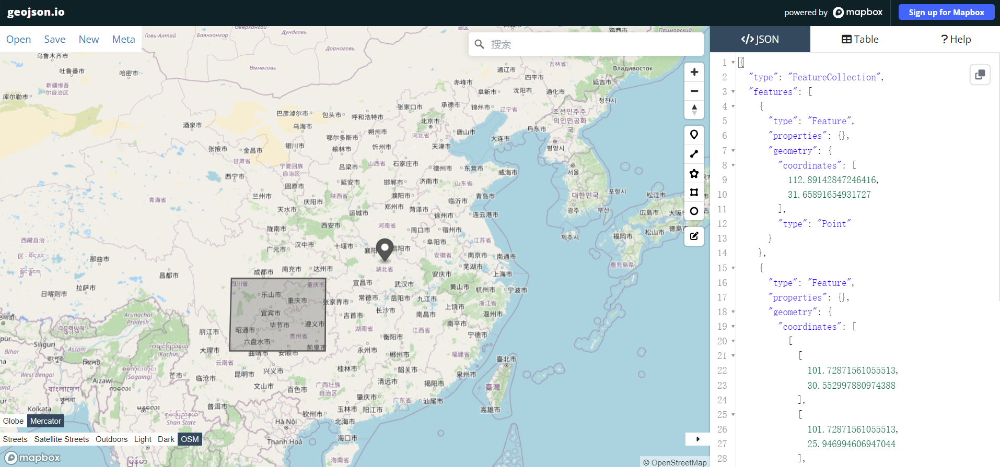

## 前言

面对地图相关需求的开发，常见的解决方案有 [ECharts](https://echarts.apache.org/zh/index.html) 和厂商地图 API（如：[高德地图](https://lbs.amap.com)、[腾讯地图](https://lbs.qq.com)等）。

其中 ECharts 多用于数据大屏中的地理数据展示，如下图：


这种线框风地图一般对地理位置的精度要求不高，展示到省级或市级就足够了。对于县级往下精度的地图展示，ECharts 实现起来就有点勉强了，拓展性不够高，而且这种精度的 GeoJSON 数据文件资源也很难获取。

这种时候一般就考虑使用厂商地图的 API 了，几行代码就能引入地图，支持缩放修改精度，还能切换地图风格等。而且拥有地点查询、经纬度逆向地点等 API，可以很大幅度地降低开发难度。但是存在一个致命的限制——对于涉及商用的项目而言，需要高达一年几万的授权费用，而这往往是一个不可逾越的障碍（悲）。

正因为上面的提到的这些问题，于是有了这篇文章准备讲述的地图开发方式。

## 准备

在开始之前，需要先提到几个名词：

-   瓦片地图
-   地图引擎
-   GeoJSON
-   地理信息分析工具

### 瓦片地图

地图加载时，并不是一次性将一整幅地图数据都渲染出来，而是分成很多尺寸相同的分片加载。我们在使用一些地图软件中也可以感受出来，地图加载经常是一点点加载出来的。


地图瓦片一般分为**矢量瓦片**和栅格瓦片两种，栅格瓦片通过图片（png/jpg 等）记录地图信息，矢量瓦片则会将各种地理信息矢量化记录。

本文使用的是[天地图](https://www.tianditu.gov.cn/)平台的栅格瓦片。由国家地理信息公共服务平台提供，目前所有服务都是免费的。

### 地图引擎

有了瓦片地图数据，如果手动把瓦片展示到页面上也不太现实，需要借助地图引擎来帮我们渲染这些数据。地图引擎一般支持渲染地图瓦片、地图上的标注信息（字体、线段、图表、风格、矢量数据等）。

本文使用的是一款开源的地图引擎 [maplibre-gl](https://maplibre.org/)

### GeoJSON

[GeoJSON](www.rfc-editor.org/rfc/rfc7946) 是一种数据格式，用于描述地理数据，可以记录点、线和面等地理数据。GeoJSON 的数据大概是这种格式：

```json
{
    "type": "FeatureCollection",
    "features": [
        {
            "type": "Feature",
            "properties": {},
            "geometry": {
                "coordinates": [111.58766169414224, 31.717448360641384],
                "type": "Point"
            }
        }
    ]
}
```



上图使用到的网站是[geojson.io](https://geojson.io/)，可以通过在地图上绘制直接生成 GeoJSON 代码。在没有 GeoJSON 数据的时候，可以通过这个网站生成。

如果需要省市的 GeoJSON 数据，可以到阿里云数据可视化平台提供的[DataV.GeoAtlas](http://datav.aliyun.com/portal/school/atlas/area_selector)中获取。如果阿里云不提供了，还可以到 github 上看看。


### 地理信息分析工具

在处理地理数据信息时，会涉及到很多数据的计算。如果要通过数学公式自己计算，需要花费大量时间精力，而且还不一定能处理得好。所以需要借助一些已有的工具，替我们处理这种专业的问题。

[Turf.js](http://turfjs.org/)是一个 javascript 的地理信息分析工具，提供了很多数据计算方法。使用 GeoJSON 数据格式，可以通过提供的方法生成图形 GeoJSON 代码，也可以对 GeoJSON 数据进行操作。

## 开始

## 最后
