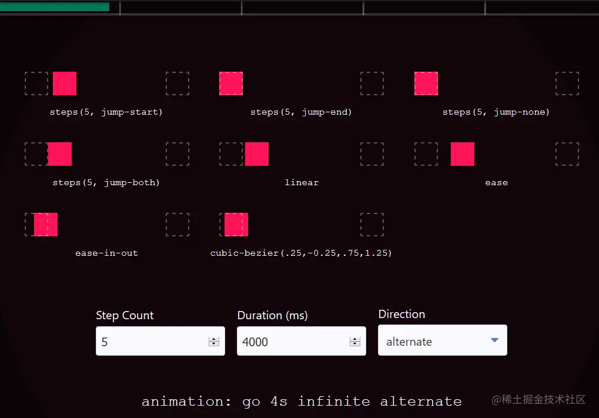

在浏览[罗技官网](https://www.logitech.com/en-us)的时候，发现他们通过 CSS 实现了 logo 的动画效果：（鼠标移上暂停动画）
<div class="main-nav-logo-anim js-main-nav-logo-anim"></div>
<style>
	.main-nav-logo-anim {
        background-image:url(https://resource.logitech.com/w_7.0,f_auto,q_auto/content/dam/logitech/en/nav/logi-logo-anim-light.png);
        background-position: -1px -1276px;
        background-repeat: no-repeat;
        background-size: 120px 1312px;
        animation: play-logo-anim 1.2s steps(34) 0s forwards;
        animation-iteration-count: infinite;
        animation-play-state: running;
        animation-delay: 2s;
        height: 34px;
        width: 120px;
        cursor: pointer;
        margin-bottom: 20px;
    }
    .main-nav-logo-anim:hover {
        animation-play-state: paused;
    }
    @keyframes play-logo-anim {
        0% {
            background-position: -1px -1px
        }
        to {
            background-position: -1px -1276px;
        }
    }
</style>

代码：

```html {11}
<div class="main-nav-logo-anim js-main-nav-logo-anim"></div>
<style>
	.main-nav-logo-anim {
        background-image: url(https://resource.logitech.com/w_7.0,f_auto,q_auto/content/dam/logitech/en/nav/logi-logo-anim-light.png);
        background-position: -1px -1276px;
        background-repeat: no-repeat;
        background-size: 120px 1312px;
        animation-name: play-logo-anim;
        animation-fill-mode: forwards;
        animation-duration: 1.2s;
        animation-timing-function: steps(34);
        animation-iteration-count: infinite;
        animation-play-state: running;
        height: 34px;
        width: 120px;
        cursor: pointer;
        margin-bottom: 20px;
    }
    .main-nav-logo-anim:hover {
        animation-play-state: paused;
    }
    @keyframes play-logo-anim {
        0% {
            background-position: -1px -1px
        }
        to {
            background-position: -1px -1276px;
        }
    }
</style>
```

## CSS3 Animation-timing-function Steps

下文源自：掘金 - [抖动的凶鸡](https://juejin.cn/user/3114296236322919/posts)

`steps()` 函数原型为

```scss
steps(num_of_steps, direction)
```

`num_of_steps` 可以简单理解为整个动画过程要跳几步，要求是一个正整数

> Is a strictly positive <integer>, representing the amount of equidistant treads composing the stepping function.
>

`direction` 按照MDN文档的解释是指定当前步进函数（阶跃函数）为左连续还是右连续函数

> Is a keyword indicating if it the function is left- or right-continuous
>

`direction` 这个定义，包括MDN文档中关于每个不同取值的图例表示都让我甚是困惑，很难和浏览器中我看到的代码效果联系起来，所以我还是直接通过现象来总结规律吧

第二个参数的所有取值有：

```sql
jump-start/start
jump-end/end -- 默认取值
jump-both
jump-none
```

这里我借用一下网名为“果冻”的大佬的一篇文章中的一个张GIF，以便展示一下各个取值的不同表现：


