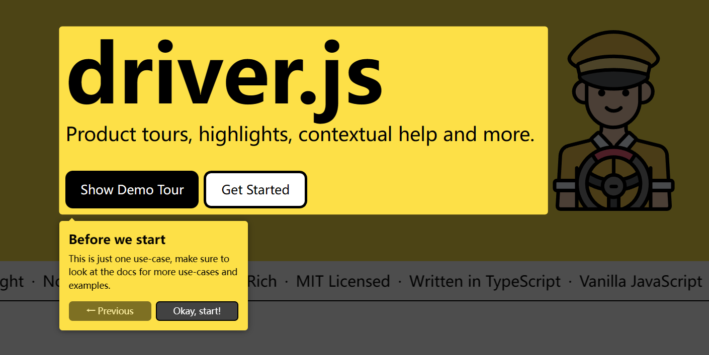

Driver.js这个库可以很好的实现：高亮部分区域，保持高亮区域可以交互，其他地方不能交互。对高亮区域添加备注，高亮区域切换的时候还有丝滑的动画。

项目地址：https://github.com/kamranahmedse/driver.js

文档：[Installation - Driver.js (driverjs.com)](https://driverjs.com/docs/installation)

## 后记

区域高亮是通过一个svg来实现的：

<svg class="driver-overlay driver-overlay-animated" viewBox="0 0 834 722" xmlSpace="preserve" xmlnsXlink="http://www.w3.org/1999/xlink" version="1.1" preserveAspectRatio="xMinYMin slice" style="fill-rule: evenodd; clip-rule: evenodd; stroke-linejoin: round; stroke-miterlimit: 2; z-index: 10000; position: fixed; top: 0px; left: 0px; width: 100%; height: 450px">
    <path d="M834,0L0,0L0,722L834,722L834,0Z
    M35,46 h500 a5,5 0 0 1 5,5 v274 a5,5 0 0 1 -5,5 h-500 a5,5 0 0 1 -5,-5 v-274 a5,5 0 0 1 5,-5 z" style="fill: rgb(0, 0, 0); opacity: 0.7; pointer-events: auto; cursor: auto;"></path>
</svg>

让高亮区域可以交互，其他区域不可交互是通过 `    pointer-events` CSS 属性来实现的

给可以交互的元素添加  `pointer-events: auto`，其他区域添加上  `pointer-events: none`
