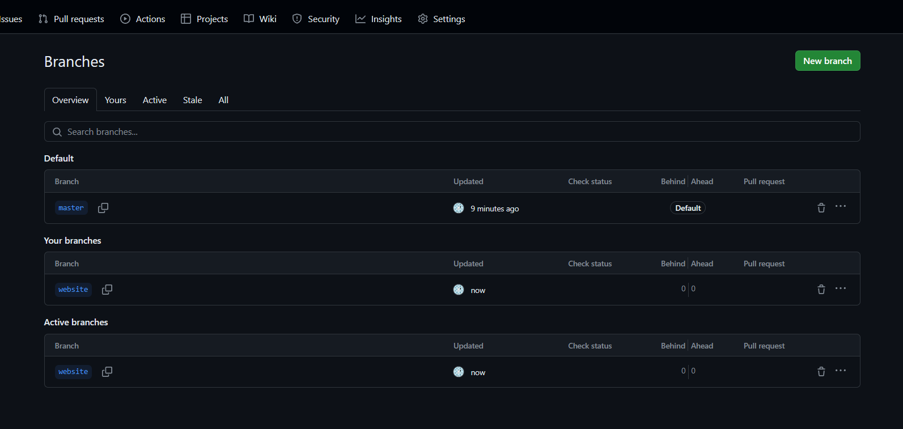
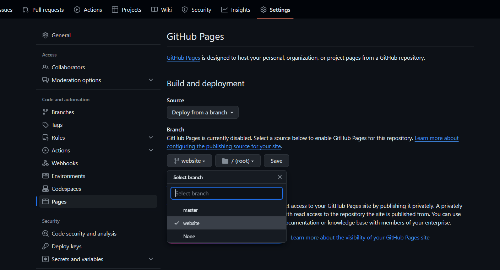
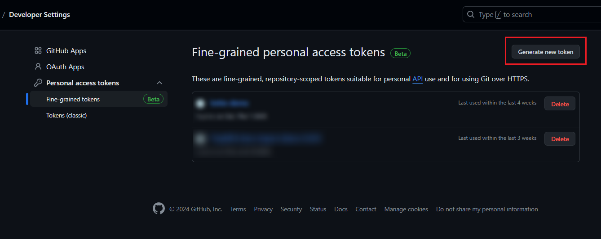
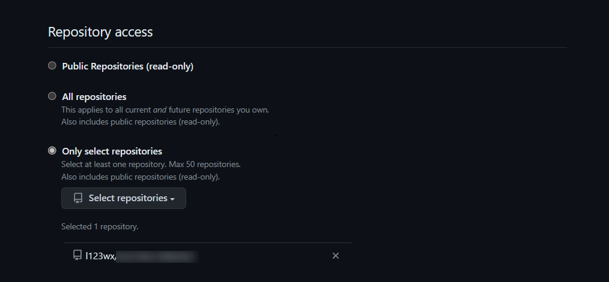
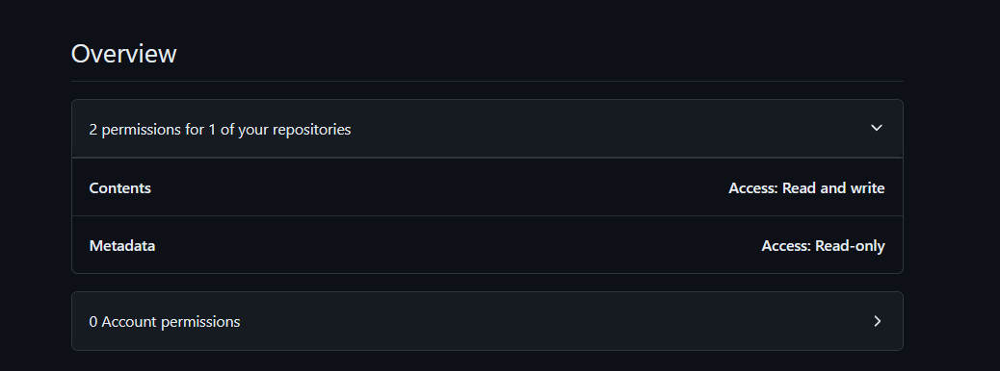
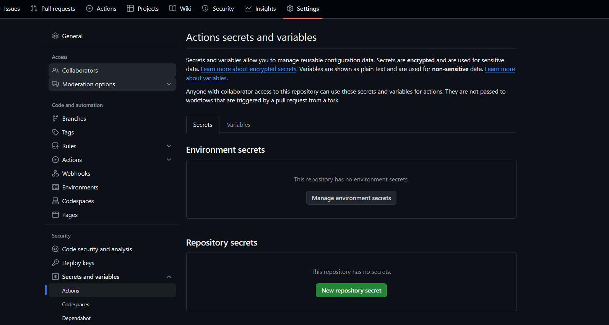
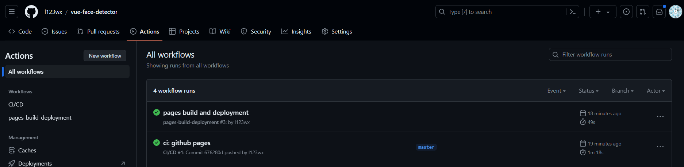
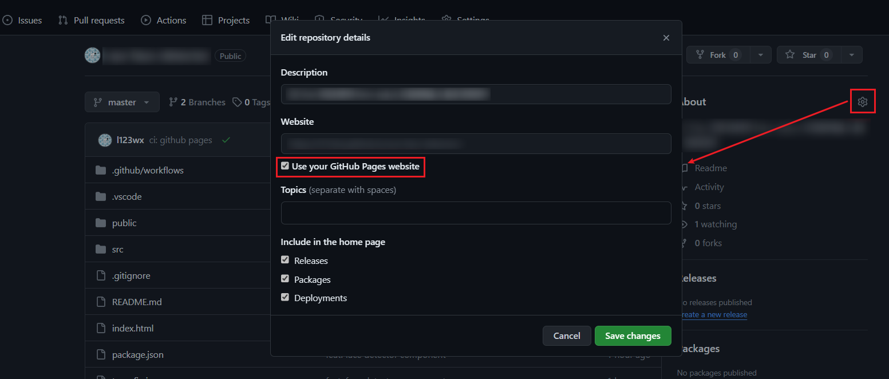

## 2024/05/27 更新

写了个 [Vue3 项目的模板](https://github.com/l123wx/starter-github-pages)，已经配置好 GitHub Actions，只需要一个操作就可以实现推送代码的时候自动打包部署 GitHub Pages 了

## 开始

### 开启仓库的 Github Pages 功能

在已有仓库中，创建一个名为 website 的新分支



在仓库的 Settings > Pages 里将 Branch 设为刚刚新建的 website 分支，点击 Save 保存修改



配置完成后，向 website 推送编译好的前端代码就会自动部署到 Github Pages

### 创建流水线配置文件

在项目目录添加 .github/workflow/main.yml

```yaml
name: CI/CD

on:
    push:
        branches:
            - master # 当 master 分支有代码更新时触发流水线

env:
    TZ: Asia/Shanghai

jobs:
    blog-cicd:
        name: build & deploy
        runs-on: ubuntu-latest # 使用最新的 Ubuntu 系统作为编译部署的环境

        steps:
            - name: Checkout codes
              uses: actions/checkout@v2

            - name: Setup node
              # 设置 node.js 环境
              uses: actions/setup-node@v1
              with:
                  node-version: '18.x'

            - name: Cache node modules
              # 设置包缓存目录，避免每次下载
              uses: actions/cache@v1
              with:
                  path: ~/.npm
                  key: ${{ runner.os }}-node-${{ hashFiles('**/package-lock.json') }}

                  # 使用 yarn：
                  # key: ${{ runner.os }}-node-${{ hashFiles('**/yarn.lock') }}

            - name: Install dependencies
              run: |
                  npm install
                  npm run build

              # 使用 yarn
              # npm install -g yarn
              # yarn
              # yarn build

            - name: Deploy
              env:
                  # Github 仓库地址（换成你自己的仓库地址）
                  GITHUB_REPO: github.com/l123wx/example-repository
              run: |
                  cd ./dist && git init && git add .
                  git config user.name "your name"
                  git config user.email "your email"
                  git add .
                  git commit -m "GitHub Actions Auto Builder at $(date +'%Y-%m-%d %H:%M:%S')"
                  git push --force --quiet "https://${{ secrets.ACCESS_TOKEN }}@$GITHUB_REPO" master:website
```

### 配置 Access Token

右上角点击头像 > Settings > Developer Settings > Personal access tokens > Fine-grained tokens，点击 Generate new token 按钮新建一个 token



选择对应的仓库



因为只需要 git push 的权限，所以只需要将 Repository permissions > Contents 设置为 Read and write 就行了



复制刚刚创建的 token，到仓库的 Settings > Secrets and analysis > Actions，点击 Repository secrets 的 新建按钮



名字设置为 ACCESS_TOKEN，这个名字不能乱填，前面添加的 yml 文件中用到了这个变量

## 完成

配置完成后，后续往 master 分支推送代码会自动触发流水线构建前端包，然后自动推送到 website 分支上触发 Github Pages 的部署



在仓库首页设置设置 Github Pages 预览地址



## 常见问题

### 资源路径问题

由于 Github Pages 部署后的页面地址不是域名的根路径，如果 Vue 项目 使用 vite 打包后出现了 public 目录资源访问路径的问题，可以尝试以下方法：

例如：已有 public > js > test.js，获取 /public/js/ 目录的路径

```js
const publicResourcePath = new URL('/js/test.js', import.meta.url).href.replace('/test.js', '')
```

这种方法可以确保开发环境和打包后都是正确的路径

## 相关文章

> [GitHub Pages 使用入门 - GitHub 文档](https://docs.github.com/zh/pages/getting-started-with-github-pages)

> [GitHub Actions 文档 - GitHub 文档](https://docs.github.com/zh/actions)
