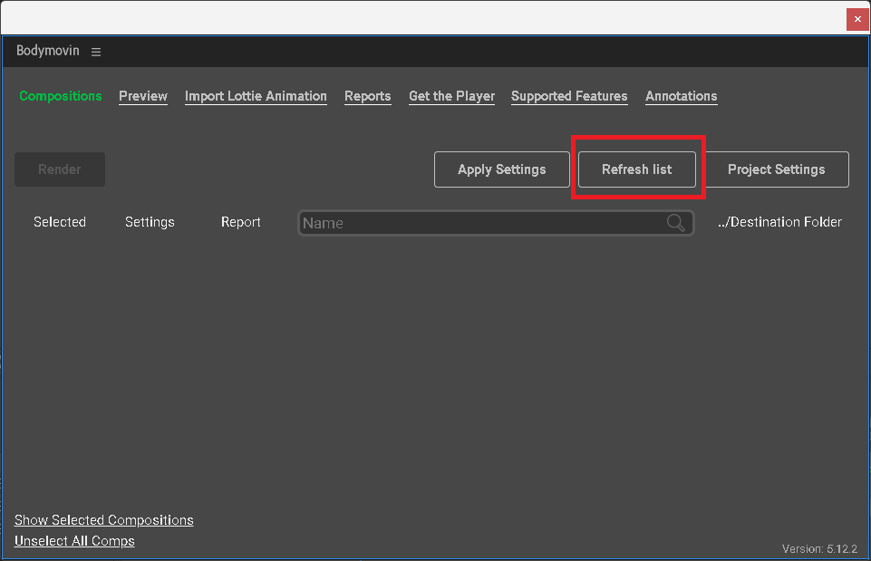

*2024新年快乐*

## 前言

在一些交互效果很好的网站 / APP 里，经常可以看到一些非常丝滑的图标过渡动画：


简单的看来，这个效果其实就是在切换图标之前，先播放一段动画，在动画结束后再显示新图标。而实现动画的播放有非常多的实现方式：

1. **切换的时候播放 GIF / 视频**

   这种方式的好处是我们完全不需要管（也没办法管）动画的实现，直接使用设计同事给我们的素材就行了；缺点也是这一点，我们无法（比较难）控制播放的进度、速度和播放方向等细节，也无法（比较难）读取当前动画的播放情况 —— 动画什么时候播放结束。这个问题虽然可以通过定时器之类的方式来实现，但是这样需要针对每个动画都定义一个持续时间的变量，当素材出现变化时，需要跟着修改这个时间，想想就让人头大。

2. **[使用 CSS3 的 Animation 实现 GIF 动画效果](/css-animation-steps)**

   这种方式跟第一种方式类似，但是我们可以通过修改 CSS3 Animation 的属性来控制动画的播放细节了。

3. **使用 GSAP 之类的动画库实现，可以通过 CSS 控制单张雪碧图展示区域的方式，也可以控制多张图片素材显隐的方式**

   这种方式虽然解决了前面提到的两个问题，但是图片数量的数量限制动画帧率上限、加载多张图片需要更多的流量，图片放大时会变模糊等问题还是难以解决。

4. **使用 Lottie 播放 After Effects 导出的动画文件**

   使用这种方式时，可以将 After Effects 画好的动画素材导出成一个 JSON 文件，这个文件里面存着动画长度、宽度、动画资源、图层信息等数据信息。通过读取 JSON 文件的信息，Lottie 就能知道动画该做什么、该怎么做，然后再将动画重绘出来。在大多数动画里，我们不需要再花费过多的流量加载图片资源，取而代之的是一个几十 KB 的 JSON 文件。不仅如此，使用 Lottie 实现由于是通过数据直接重绘动画，没有帧率上限，也不会随着尺寸变模糊，拥有更好的展示效果。缺点是 Lottie 不支持 After Effects 全部的功能，在绘制动画的时候需要注意。

   > [那些年被Lottie坑过的地方 - 知乎 (zhihu.com)](https://zhuanlan.zhihu.com/p/59794085)

   > [Supported After Effects Features (airbnb.io)](https://airbnb.io/lottie/#/supported-features)

## 开始使用 Lottie

### 安装

```shell
npm install lottie-web
```

### 使用

调用 `Lottie.loadAnimation(params)` 创建动画，这个方法会返回一个动画实例 `AnimationItem`

**params**:

- animationData

  包含导出的动画数据的对象。

- path

  动画对象的相对路径。（animationData 和 path 互斥）

- loop

  循环：`true` / `false` / `number`

- autoplay

  自动播放，可选值：`true` / `false`

- name

  动画名称

- renderer

  设置渲染器，可选值： `svg` / `canvas` / `html`

- container

  用于渲染动画的 DOM 元素

```vue
<template>
    <div ref="containerRef"></div>
</template>

<script setup lang="ts">
    import { onMounted, ref } from 'vue'
    import Lottie, { AnimationItem } from 'lottie-web'
    import AnimationJSON from './assets/Animation.json'

    const animate = ref<AnimationItem>()
    const containerRef = ref()

    onMounted(() => {
        animate.value = Lottie.loadAnimation({
            animationData: AnimationJSON,
            renderer: 'svg',
            autoplay: false,
            container: containerRef.value
        })
        
        animate.value!.play()
    })
</script>
```

#### 动画实例上主要有以下方法

- play()

  播放该动画，从目前停止的帧开始播放。

- stop()

  停止播放该动画，回到第 0 帧。

- pause()

   暂停该动画，保持当前帧显示。

- setSpeed(speed)

  设置播放速度，1 为正常速度。

- goToAndStop(value, isFrame) 

  跳到某个时刻/帧并停止。`isFrame` 表示 `value` 是帧还是时间（毫秒）。（默认为 false）

  `value` 也可以输入 [Marker Name](#MarkerName)，会跳转到 marker 指定的动画。

  这个方法会中断正在执行的动画。

- goToAndPlay(value, isFrame)

  跳到某个时刻/帧并开始播放。

  这个方法会中断正在执行的动画。

- setDirection(direction)

  设置动画播放方向，1 表示正向播放，-1 表示反向播放。

- playSegments(segments, forceFlag)
  第一个参数是单个数组或多个数组，每个数组有两个值（`fromFrame`，`toFrame`），第二个参数 `forceFlag` 是布尔值，用于立即强制新段。

  - playSegments([10, 20], false)

    表示播放完当前正在播放的动画后，播放 10 - 20 帧。

  - playSegments([[0, 5], [10, 18]], true)

    表示中断当前正在播放的动画，直接播放 0 - 5 帧和 10 - 18 帧。

- setSubframe(flag)

  如果设置为 false，它将遵循原始 After Effects fps。如果为 true，它将尽可能多地更新。（默认为 true)

- destroy()

#### 监听事件

```js
AnimationItem.addEventListener('eventName', () => {})
```

| 名称         | 描述                                                         |
| ------------ | ------------------------------------------------------------ |
| data_ready   | 加载完 json 动画                                             |
| complete     | 播放完成（循环播放下不会触发）                               |
| loopComplete | 当前循环下播放（循环播放/非循环播放）结束时触发              |
| enterFrame   | 每进入一帧就会触发，播放时每一帧都会触发一次，stop 方法也会触发 |
| segmentStart | 每进入一帧就会触发，播放时每一帧都会触发一次，stop 方法也会触发 |
| DOMLoaded    | 动画相关的 dom 已经被添加到 html 后触发                      |
| destroy      | 将在动画删除时触发                                           |

#### 工具方法

不知道为什么官方只提供 `goToAndPlay` 方法通过 [Marker Name](#添加-markers) 的形式调用预置的 `Segment`，而且这个方法只能中断当前正在播放的动画。我们可以通过以下代码来实现：

```js
import { AnimationItem } from 'lottie-web'

export const playSegmentByName = (animationItem: AnimationItem, name: string, forceFlag: boolean = true) => {
    // @ts-ignore
    const markerData = animationItem.getMarkerData(name)
    if (!markerData) return

    animationItem.playSegments(
        [markerData.time, markerData.time + markerData.duration],
        forceFlag
    )
}
```

通过调用 `AnimationItem` 原型链上的 `getMarkerData` 方法获取 [Marker](#添加-markers) 的信息，再调用自带的 `playSegments` 方法播放动画

#### 使用技巧

通过调用 `playSegmentByName` 我们可以实现通过 Marker Name 调用动画，但是会发现这样调用动画之后无法会一直循环播放，如果你想让动画播放结束之后停在最后一帧，可以在 `playSegmentByName` 调用后再调用 `setLoop` 方法停止循环播放：

```js
const animationItem = Lottie.loadAnimation({...})

playSegmentByName(animationItem, 'success', false)
animationItem.setLoop(false)
```

如果你只有状态1 => 状态2 的动画，当处于状态2时，想再切换回状态1，可以通过 `setDirection` 方法逆向播放已有的动画：

```js
const animationItem = Lottie.loadAnimation({...})

// 逆向播放当前正在播放的动画
animationItem.setDirection(-1)
// 播放结束后播放状态1的动画
playSegmentByName(animate.value!, '状态1', false)
```

#### 注意事项

当不再使用 Lottie 组件时，一定要及时调用 destroy 卸载动画，否则 Lottie 会一直调用 requestAnimationFrame 导致 CPU 占用率提高

#### 完整代码

[l123wx/lottie-demo (github.com)](https://github.com/l123wx/lottie-demo)

#### 动画 JSON 下载

[LottieFiles Platform](https://app.lottiefiles.com/)

### 动画绘制 & JSON 导出

Lottie 的动画绘制使用到的是 After Effects，同时还需要为 After Effects 安装 Bodymovin 插件

#### 安装 Bodymovin

##### 1.如果你正在使用 After Effects，先关闭它

##### 2.安装 ZXP 安装器

首先下载 ZXP 安装器：[ZXP/UXP Installer](https://aescripts.com/learn/zxp-installer/)


下载完成后打开安装包，需要勾选 ZXP / UXP Installer


##### 3.下载 Bodymovin 扩展包

https://raw.githubusercontent.com/airbnb/lottie-web/master/build/extension/bodymovin.zxp

##### 4.安装

打开刚才安装好的 ZXP / UXP Installer，将下载好的 bodymovin.zxp 扩展包拖到 Installer 里


看到列表里面显示了就说明扩展安装成功了


#### 添加 Markers

点击下图的按钮，即可在游标位置添加一个标记。注意添加完之后是在最上面的时间轴显示的，如果是在图层的时间轴上显示说明操作有误，请点击下图的按钮添加标记。


鼠标直接拖动，可以移动整个标记；

按住键盘 Alt 再拖动，可以单独移动结束标记，加上 Shift 可以吸附到图层时间轴上；

对着标记右键，点击设置，在注释输入框输入 Marker Name，遵循这个格式：

```json
{"name": "example name"}
```


#### 导出

安装了 Bodymovin 扩展之后，在 After Effects 的 `窗口 > 扩展 > Bodymovin` 可以打开 Bodymovin 扩展进行导出操作。


如果打开之后发现是空的，可以点击 `Refresh list` 按钮刷新列表。




点击 [1] 选中想要导出的动画，点击 [2] 设置导出路径，最后点击 Render 按钮就可以导出 JSON 文件了。

如果导出时报错，需要在 After Effects 的 `编辑 > 首选项 > 常规` 中勾选 `允许脚本写入文件和访问网络`

打开 JSON 文件，可以看到文件里记录着 assets、layers 和 markers 等属性，其中 markers 里记录的就是我们刚刚添加的标记。


## 相关文章

> [Web (airbnb.io) | 官方文档](https://airbnb.io/lottie/#/web)

> [After Effects (airbnb.io) | After Effects 插件安装的官方文档](https://airbnb.io/lottie/#/after-effects)

> [如何在 After Effects 中设置 Named Markers (lottiefiles.com)](https://lottiefiles.com/blog/tips-and-tutorials/how-to-setup-named-markers-in-lottie-animations)

> [飞书中 Lottie 动画的应用 - 掘金 (juejin.cn)](https://juejin.cn/post/6966866737396449316?searchId=20240103100136E180E7D6BBE6D2051FB4)

