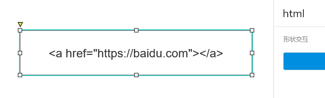
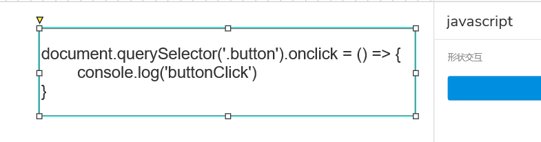

## 前言

在原型里插入代码，这件事可能会让人感到不解（什么情况下会进行这么复杂的操作），但是确实是遇到了，便在这里记录一下。

## 开始

### 原理

-   Axure 添加交互中打开链接的动作
-   `a` 标签的`href` 属性，通过 `javascript:;` 写法执行 js 代码

### 操作

#### 插入 html

在页面中添加矩形元件，将名字改为 `html`，在矩形的内容中直接输入 html 代码，如：



添加**页面 载入时**的交互，添加打开链接动作，链接设置为如下内容：

```js
javascript: document.querySelectorAll('[data-label=html]').forEach(item => {
    item.innerHTML = item.querySelector('p>span').innerText;
})
```

这样当页面加载时，会将所有名字为 html 的矩形中的内容换到这个矩形的 div 中。

这里有个小技巧，可以将 html 标签宽高设置为 100%，这样就可以继续通过 Axure 控制大小和位置。

通过上面插入 html 的方式，其实可以直接插入 `script` 标签来实现插入 js 代码。不过要注意要将插入的代码一行显示，因为 Axure 会将换行的文字用单独的 `p` 标签包裹起来，导致上面的代码没办法完整的执行插入的内容。

不能换行和缩进的 js 代码实在难受，所以就有了下面这种插入 js 代码的方式。

#### 插入 javascript

在页面中添加矩形元件，将名字改为 `javascript`，在矩形的内容中直接输入 js 代码，如：



添加**页面 载入时**的交互，添加打开链接动作，链接设置为如下内容：

```js
javascript: document.querySelectorAll('[data-label=javascript]').forEach(item => {
    item.outerHTML = '';
    eval(item.innerText.replace(/<.*?>/g, ''));
})
```

这样就可以顺利的插入 js 代码了，可以将装有js代码的矩形设置为不可见，这样js代码也能正常运行，并且不会显示在页面上。

需要注意的是，js 代码中如果出现了 html 标签，需要转译一下，不然会被清除。

## 最后

附上一个 demo 文件：[code.rp](./assets/code.rp)
