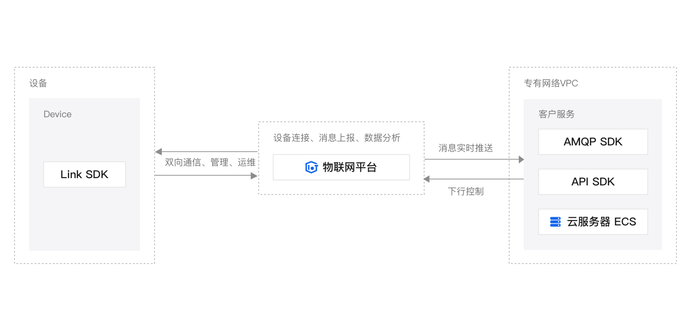

使用阿里云提供的服务，在硬件上安装阿里云提供的固件，可以同步数据到云端服务器

硬件方面使用的是：工业路由器，内置esim，可以联网，带有gps功能

相关链接：

[车辆数据安全稳定上云和分析 (aliyun.com)](https://www.aliyun.com/solution/tech-solution/sarcaaaovd?spm=5176.28392244.J_RBPYc2NmyQx5oQMr6l3Ng.1.102c20dduID2wK)

[串口服务器_4G DTU_5G工业路由器_边缘计算网关_以太网/蓝牙/Lora/WIFI模块-济南有人物联网技术有限公司官网 (usr.cn)](https://www.usr.cn/)
