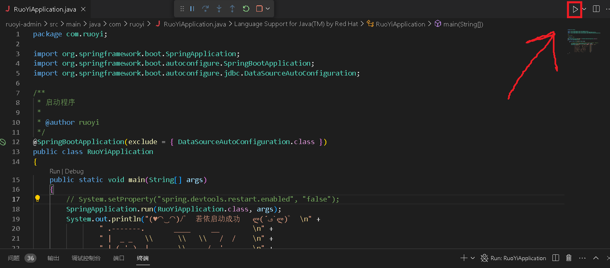

## 开发

### 项目地址

- 若依官网：http://120.79.202.7/
- RuoYi-Vue：https://gitee.com/y_project/RuoYi （后端 Java Spring）
  - 文档：http://doc.ruoyi.vip/ruoyi-vue/
- RuoYi-Vue3：https://github.com/yangzongzhuan/RuoYi-Vue3 （前端 Vue3）

### 开发环境准备

若依上的版本要求：

- JDK >= 1.8
- MySQL >= 5.7
- Maven >= 3.0
- Node >= 12
- Redis >= 3

#### VSCode

使用 VSCode 开发，打开 VSCode 点击左下角齿轮，配置文件 > 创建配置文件，复制来源选择Java Spring。创建成功后选择该配置文件，会切换到安装好 Java 开发所需拓展的环境。

#### JDK

1. 在  VSCode 按 Ctrl + Shift  + P，输入 `java jdk`，点击 Java: Install New JDK，进入如下页面：

   

   选择需要下载的版本，点击 Download 后会自动跳转下载

   

2. 打开下载好的文件，一路点继续完成安装，会自动配好 JDK 的环境变量，默认的安装路径： `C:\Program Files\Eclipse Adoptium\jdk-17.0.9.9-hotspot`

**也可以手动下载**：

1. 到 [OpenJDK](https://jdk.java.net/archive/) 官网下载 JDK 压缩包，这里我下载的是 JDK19，将下载好的压缩包解压到 `C:\Program Files\Java` （其他目录也可以）。

   

2. 配置 系统变量，添加 `C:\Program Files\Java\jdk-19\bin`（根据实际配置）

#### Maven

1. [点击此处](http://maven.apache.org/download.cgi)下载对应版本安装文件

   

2. 下载完成后解压到 `C:\Program Files\Java\Maven\apache-maven-3.9.5`（根据实际配置）

3. 配置环境变量 `C:\Program Files\Java\Maven\apache-maven-3.9.5\bin`

#### MySQL

1. [点击此处](https://dev.mysql.com/downloads/mysql/)下载安装文件，点击 Download 后直接点击左下角 `No thanks, just start my download.`

   

2. 打开下载好的安装文件，一路点 Next，完成安装，中间需要为 root 账号设置密码

3. 配置环境变量，添加 `C:\Program Files\MySQL\MySQL Server 8.0\bin`（根据实际配置）

#### Redis

1. [点击此处](https://github.com/tporadowski/redis/releases)下载安装文件

   

2. 打开安装文件，下图的选项勾上，自动添加环境变量，接着还是一路 Next 完成安装。

   

### 开始项目开发

#### 新建数据库

使用 HeidiSQ 工具完成数据库连接和操作，[下载地址](https://www.heidisql.com/download.php?download=installer#google_vignette)

1. 新建数据库：ruoyi-vue，字符校对选择 `utf8mb4_general_ci`

2. 初始化数据库表：

   1. 选中刚刚新建的数据库 ruoyi-vue

   2. 点击左上角 文件 > 运行 SQL 文件，选择 ruoyi-vue/sql 目录下的 quartz.sql 和 ry_20230706.sql 文件（后面那个文件名称中的日期会随若依版本变化）

      

#### 项目配置

使用 VSCode 打开 RuoYi-Vue 项目

##### 数据库配置

打开 `/ruoyi-admin/src/main/resources/application-druid.yml` 文件

修改数据库配置信息：

- `localhost:3306` MySQL 地址

- `ry-vue` 数据库名称，由于刚刚创建的数据库名称为 ruoyi-vue，所以需要将这里改为 ruoyi-vue
- username 和 password 也需要根据实际情况设置

##### 其他配置

其他配置在 `/ruoyi-admin/src/main/resources/application.yml` 文件里

#### 运行项目

完成上述配置修改后，打开 `/ruoyi-admin/src/main/java/com/ruoyi/RuoYiApplication.java` 文件，点击右上角运行按钮，就可以启动项目了

#### 代码生成

1. 创建数据库表

2. 使用前端页面的代码生成工具，导入数据库表，点击编辑完成配置

   将模块名改为 custom，生成包路径改为 com.ruoyi.custom，将二开的代码和系统自带的代码分开

   

3. 配置好之后点击下载，解压覆盖到 ruoyi-admin 对应目录下，重启项目就可以了

## 部署

### 项目打包

使用 Maven 进行打包：到 ruoyi-vue 根目录下执行 `mvn clean package` 命令，生成的 jar 包在 ruoyi-admin/target 目录下

通过 java -jar ruoyi-admin.jar 运行项目，默认运行到 80 端口

### 服务器环境准备

#### JDK

#### MySQL

##### 安装

##### 数据迁移

#### Redis
