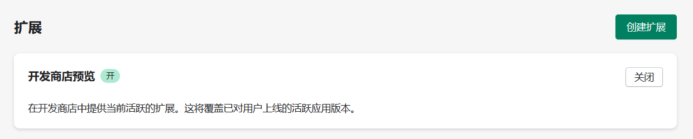

## 开始

### 环境要求

Node.js 版本大于或等于 18

### Ruby 安装

#### windows 安装

```shell
winget install RubyInstallerTeam.RubyWithDevKit.3.2
```

安装是否成功

```shell
ruby -v
```

#### 其他系统

#### [安装 Ruby (ruby-lang.org)](https://www.ruby-lang.org/zh_cn/documentation/installation/)

## 创建 Shopify APP

```shell
# npm
npm init @shopify/app@latest

# Yarn
yarn create @shopify/app

# pnpm
pnpm create @shopify/app
```

### 遇到的问题

#### 卡在 Downloading template from https://github.com/Shopify/shopify-app-template-remix#main...

在终端 `ping github.com`，然后将显示的 ip 地址设置到系统的 hosts 文件。hosts 文件路径：`C:\Windows\System32\drivers\etc`

#### 卡在 Installing dependencies ...

这个地方是在安装 node_modules 的依赖，可以开梯子试一下

## 创建 Theme Extension

在 app 目录下执行

```shell
# npm
npm run shopify app generate extension

# Yarn
yarn shopify app generate extension

# pnpm
pnpm shopify app generate extension
```

创建完成后，会在 app 的 extensions 文件夹内看到刚刚创建的 extension 的代码

## 开始 Theme Extension 开发

运行项目

```shell
npm run dev
```

### 遇到的问题

#### 为什么在商店的主题编辑页面看不到我们 Theme Extension 的应用块

1. 到 [shopify partners](https://partners.shopify.com/) > 应用，点击刚刚创建的应用名称，进入应用详情页。点击左边菜单的 [拓展]，将 [开发商店预览] 开启

   

2. 第一次运行 extension 时，需要先运行 `npm run deploy` 命令

#### 为什么修改了代码，刷新页面后应用块没有更新

1. 检查终端，看看 app 是不是还在运行，有时候网络问题会导致服务停止
2. 执行 `npm run deploy` 命令检查代码是否有问题，有些代码问题没有提示，而且出错的时候会自动获取线上版本的 extension

### 在 Theme Extension 中使用 Vue

引入 Vue：[快速上手 | Vue.js (vuejs.org)](https://cn.vuejs.org/guide/quick-start.html#using-vue-from-cdn)

可以将包下载放到 assets 目录下，通过以下方式使用 shopify 官方的 cdn

```html
<script defer src="{{ 'vue.global.prod.js' | asset_url }}"></script>

<!-- 由于 liquid 模板也是使用 {{}} 模板字符串解析表达式，所以使用 Vue 的时候需要用 v-text 来绑定变量的值 -->
<div id="example-theme-extension" v-text="hello"></div>
```

```js
const { createApp, ref } =
    Vue

createApp({
    setup() {
        const hello = ref('Hello World')
        return {
            hello
        }
    }
// vue 的根节点 id 不要使用 app，避免根页面出现冲突
}).mount("#example-theme-extension")
```

### 在外部 js 文件中使用 liquid 模版中的变量

在 liquid 文件中将变量赋值给 window 下的全局变量，再在外部 js 文件中访问

```html
<script defer>
  window.__EXAMPLE_GLOBAL_DATA = {
    shop: {
      name: '{{ shop.name }}',
    },
    customer: {
      id: '{{ customer.id }}',
      email: '{{ customer.email }}',
    }
  };
</script>
<script defer src="{{ 'index.js' | asset_url }}"></script>
```

```js
// index.js
console.log(window.__EXAMPLE_GLOBAL_DATA.shop.name)
```

