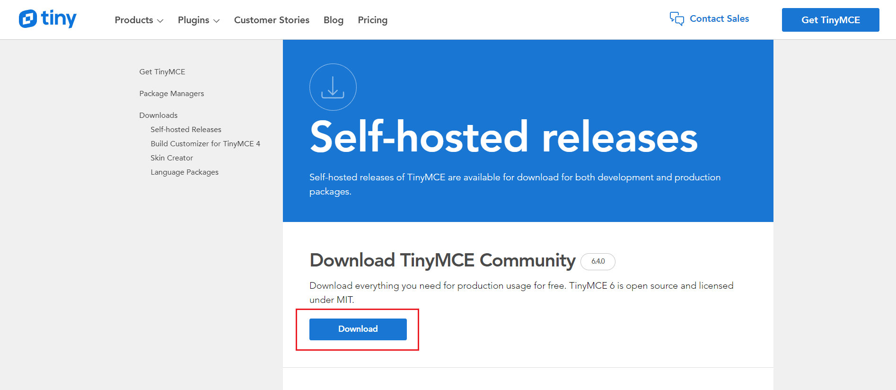
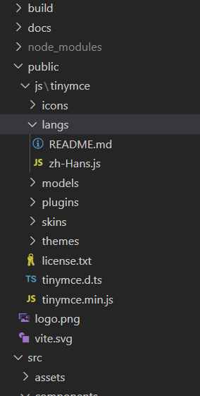
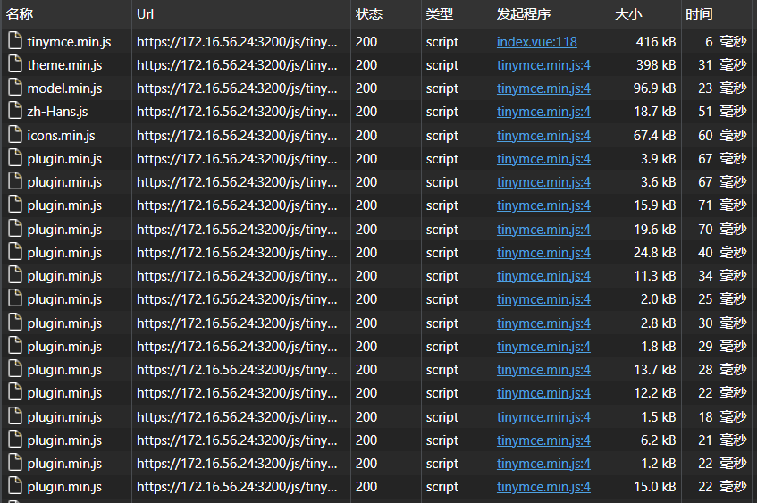

## 前言

出于以下原因，我们可能需要使用离线版的 TinyMCE：

 - 内网部署，无法访问外部资源
 - 希望通过直接访问本地资源优化加载速度
 - 不想使用 api-key

本文中以 Vue3 项目为例，使用离线版本的 TinyMCE

## 操作步骤

### 资源准备

在 TinyMCE [官网下载](https://www.tiny.cloud/get-tiny/self-hosted/) 代码包，如果没有查看源码的需求，可以直接下载 Prod 版本



将下载的代码包解压移动到项目的 `/public` 目录下，如果需要添加语言包的话，添加到 `langs` 文件夹中



### 编写代码

#### Vue3 (暂未实际运行，只提供编写思路)

新建一个 Editor 组件

```vue
<!-- Editor.vue -->
<template>
    <textarea id="editor"></textarea>
</template>

<script setup lang="ts">
    import { ref, watch } from 'vue'
    import { RawEditorOptions, Editor } from 'public/js/tinymce/tinymce'
    
    const BASE_URL = '/js/tinymce'
    
    const props = defineProps<{
        value: string
    }>()
    
    const emits = defineEmits<{
       (event: 'update:value', value: string) 
    }>()
    
    let tinymceEditor: Editor
    const currentValue = ref('')

    const initOptions: RawEditorOptions = {
        selector: 'textarea#editor',
        language: 'zh-Hans',
        language_url: BASE_URL + '/langs/zh-Hans.js',
        // 静态资源文件路径
        base_url: BASE_URL,
        // 我们引入的是 tinymce.min.js，需要使用 suffix 添加 .min 后缀
        suffix: '.min',
        // 关闭 upgrade 按钮
        promotion: false,
        init_instance_callback: tinymceEditor => {
            // Tinymce 初始化完成时将 props.value 赋值给富文本
            tinymceEditor.setContent(currentValue.value || '', {
                format: 'html'
            })
        },
        setup: editor => {
            // 监听富文本输入，更新 value
            editor.on('input', () => {
                currentValue.value = that.getContent()
                that.$emit('update:value', currentValue.value)
            })
            editor.on('ExecCommand', () => {
                currentValue.value = that.getContent()
                that.$emit('update:value', currentValue.value)
            })
        }
        ...
    }
    
    const getContent = () => {
        return (
            tinymceEditor?.getContent({
                format: 'html'
            }) || ''
        )
    }
    
    watch(() => props.value, newValue => {
        if (newValue !== currentValue.value) {
            currentValue.value = newValue === null ? '' : newValue
            if (tinymceEditor) {
                tinymceEditor.setContent(currentValue.value, {
                    format: 'html'
                })
            }
        }
    }, {
        immediate: true
    })

    onMounted(() => {
        const script = document.createElement('script')
        script.src = BASE_URL + '/tinymce.min.js'
        script.onload = async () => {
            // 初始化 TinyMCE 并保存返回的 Editor 对象
            ;[tinymceEditor] = await window.tinymce.init(initOptions)
        }
        document.body.appendChild(script)
    })
</script>
```

在页面中使用

```vue
<template>
    <Editor v-model:value="value" />
</template>

<script setup lang="ts">
    import { ref } from 'vue'
    import Editor from 'examplePath/Editor.vue'
    
    const value = ref('')
</script>
```

#### Vue 2

新建一个 Editor 组件

```vue
<template>
    <div class="container">
        <textarea id="editor"></textarea>
    </div>
</template>

<script>
    const BASE_URL = '/js/tinymce'
    
    export default {
        name: 'Editor',
        props: {
            /* 编辑器的内容 */
            value: {
                type: String,
                default: ''
            },
            /* 只读 */
            readOnly: {
                type: Boolean,
                default: true
            }
        },
        data() {
            const that = this

            return {
                tinymceEditor: null,
                isEditorInitialized: false,
                initOptions: {
                    selector: 'textarea#editor',
                    language_url: BASE_URL + '/langs/zh-Hans.js',
                    language: 'zh-Hans',
                    base_url: BASE_URL,
                    suffix: '.min',
                    // 关闭 upgrade 按钮
        			promotion: false,
                    readonly: this.readOnly,
                    init_instance_callback: tinymceEditor => {
                        tinymceEditor.setContent(that.value || '', {
                            format: 'html'
                        })
                        that.isEditorInitialized = true
                    },
                    setup: editor => {
                        editor.on('input', () => {
                            this.currentValue = that.getContent()
                            that.$emit('input', this.currentValue)
                        })
                        editor.on('ExecCommand', () => {
                            // 富文本初始化时会触发这个回调，而那个时候我们还没将内容初始化好，这里是为了避免 $emit 空内容出去导致值丢失
                            if (!that.isEditorInitialized) return

                            this.currentValue = that.getContent()
                            that.$emit('input', this.currentValue)
                        })
                    },
                    ...
                }
            }
        },
        watch: {
            value: {
                handler(val) {
                    if (val !== this.currentValue) {
                        this.currentValue = val === null ? '' : val
                        if (this.tinymceEditor) {
                            this.tinymceEditor.setContent(this.currentValue, {
                                format: 'html'
                            })
                        }
                    }
                }
            }
        },
        mounted() {
            this.init()
        },
        beforeDestroy() {
            this.tinymceEditor = null
        },
        methods: {
            init() {
                const script = document.createElement('script')
                script.src = BASE_URL + '/tinymce.min.js'
                script.onload = async () => {
                    // 初始化 TinyMCE 并保存返回的 Editor 对象
                    ;[this.tinymceEditor] = await window.tinymce.init(
                        this.initOptions
                    )
                }
                document.body.appendChild(script)
            },
            getContent() {
                return (
                    this.tinymceEditor?.getContent({
                        format: 'html'
                    }) || ''
                )
            }
        }
    }
</script>

<style lang="scss">
    // 修复菜单被弹窗遮挡的问题
    .tox-tinymce-aux.tox {
        z-index: 1000000;
    }
</style>
```

运行项目，可以看到所有资源都是请求的本地资源



### TypeScript

如果使用 `TypeScript` 的话，还需要对类型进行配置

首先在 `tsconfig.json` 文件中加入 TinyMCE 的类型文件：

```json
{
    "include": [
        "public/js/tinymce/tinymce.d.ts"
    ]
}
```

在 `/src` 目录下添加 `window.d.ts` 文件，添加如下代码：

```typescript
import { TinyMCE } from 'public/js/tinymce/tinymce'

declare global {
    interface Window {
        tinymce: TinyMCE
    }
}
```

这段代码会在 `window` 对象上添加 `tinymce` 属性
