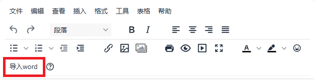
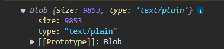
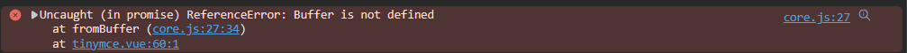

## 前言

遇到这种需求第一时间当然是看看有没有可以直接用的轮子，但是找到的 [ImportWord](https://tinymce-plugin.gitee.io/packages/tp-importword/introduction.html) 插件无法正常使用，而且很久没有维护了，所以只能自己动手实现这个功能了

上网冲浪后得知，word 文档解析主要有 [mammoth.js](https://github.com/mwilliamson/mammoth.js) 和 [docx-preview.js](https://github.com/VolodymyrBaydalka/docxjs) 这两个库，据网友所言，后者效果更为甚之，故用之

## 开始

### 在 TinyMCE 菜单添加导入按钮

```vue
<template>
	...
    <input type="file" ref="importWordUploadRef" accept=".docx" style="display: none;" @input="handleWordFileUpload" />
	...
</template>

<script setup>
    const importWordUploadRef = ref()
    
	const initOptions = {
        ...
        // 添加 importWord
        toolbar: '... | importWord | ...',
        setup: () => {
            // 注册 importWord
            editor.ui.registry.addButton("importWord", {
                text: "导入word",
                // icon:'', // 目前使用文字按钮，如果需要图标展示，根据文档中自定义图标中的内容进行配置
                onAction: function () {
                    // 触发文件上传
                    importWordUploadRef.value.click()
                },
            })
        }
    }
</script>
```

效果如下：



### 核心逻辑实现

#### 安装 docx-preview

```shell
npm install docx-preview
```

#### 使用

```js
import * as Docx from 'docx-preview'

// docx-preview 没有提供直接返回 html 的方法，所以用创建 dom 接收 html 的方法“曲线救国”
const renderHtmlAsync = async wordFile => {
    const importWordUploadContainerDom = document.createElement("div")
    
    await Docx.renderAsync(wordFile, importWordUploadContainerDom, null, {
        // 取消宽高限制，不然会固定一个页面大小，展示效果不好
        ignoreHeight: true,
        ignoreWidth: true
    })
    
    // 去除 word 中的边距
    importWordUploadContainerDom.querySelector('.docx').style.padding = 0
    const wordHtmlContent = importWordUploadContainerDom.innerHTML
    
    return wordHtmlContent
}

const handleWordFileUpload = (e) => {
    const wordFile = e.srcElement.files[0]
    // 将上传文件的 input value 置空，否则会出现第二次上传相同文件的时候不回调的问题
    importWordUploadRef.value.value = null
    
    const wordHtmlContent = await renderHtmlAsync(wordFile)

    // 将导入的 word 内容追加到富文本内容中
    tinymceEditor.setContent(tinymceEditor.getContent() + wordHtmlContent)
}
```

## 遇到的坑

使用 TinyMCE 的 `setContent` 方法时，如果 html 里有图片，会触发 TinyMCE 的 `images_upload_handler` 方法。我们可以在这里将word 原有的图片上传到服务器上。但是实际操作时会发现一个问题：docx-preview.js 在渲染 html 的时候，将 word 中的文件替换成了临时的 blob 链接，而且这个 blob 的 type 变成了 `text/plain`，这就意味着原文件的类型丢失了。如果直接上传这个 blob 文件，下载这个文件时只能得到 `.blob` 后缀的文件

```js
images_upload_handler: blobInfo => {
    console.log(blobInfo.blob())
}
```



再次冲浪后得知，就算 blob 中的 type 丢失了，还有方法可以获取文件的真实类型 —— 魔数

### 魔数

文件起始的几个字节内容是固定的，这几个字节的内容记录着文件的类型，这些内容被称为"[Magic Number（魔数/幻术）](https://en.wikipedia.org/wiki/Magic_number_(programming)#In_files)"

file-type 这个 js 库就是通过魔数去获取文件类型的，所以我们可以使用这个库读取文件的真实类型

### file-type

[仓库地址](https://github.com/sindresorhus/file-type)

#### 安装

安装 16.5.4 版本的 file-type，19.0.0 版本经过测试已经无法使用下面提到的方法解决 Buffer undefined 的问题，其他版本暂时不确定行不行，建议直接安装 16.5.4 版本

```shell
npm install file-type@16.5.4
```

#### 使用

```js
import { fromBuffer } from 'file-type/core'

const blobType = await fromBuffer(await blob.arrayBuffer())
```

因为 file-type 是 nodejs 的库，如果直接在浏览器中使用，会出现 Buffer is not defined 的报错



我们可以手动设置 Buffer 全局变量来解决这个问题

#### 安装 buffer 依赖

```shell
npm install buffer
```

一定要注意，这里安装的依赖是 buffer 而不是 Buffer

```js
import { Buffer } from 'buffer'
// 添加 Buffer 全局变量
window.Buffer = window.Buffer || Buffer
```

至此，就能完整的实现 TinyMCE 导入 word 文件的功能了，并且可以将导入的图片上传到服务器上

## 完整示例

[l123wx/tinyMCE-docx-preview-demo (github.com)](https://github.com/l123wx/tinyMCE-docx-preview-demo)

### 核心代码：

```vue
<template>
  <div>
      <!-- <textarea :id="TINYMCE_ID"></textarea> -->
    
      <input type="file" ref="importWordUploadRef" accept=".docx" style="display: none;" @input="handleWordFileUpload" />
  </div>
</template>

<script>
    import { Buffer } from 'buffer'
    window.Buffer = window.Buffer || Buffer
</script>

<script setup>
    import * as Docx from 'docx-preview'
    import { fromBuffer } from 'file-type/core

    const TINYMCE_ID = "selector_" + Date.now()
    
    const importWordUploadRef = ref()
    
    const isUnknownTypeBlob = (blobUri) => {
        return blobUri.startsWith('blob')
    }

    const initOptions = {
        ...
        toolbar: 'importWord',
        images_upload_handler: (blobInfo, succFun, failFun) => {
            return new Promise(async resolve => {
                let file = blobInfo.blob()

                if (isUnknownTypeBlob(blobInfo.blobUri())) {
                    const blob = blobInfo.blob()
                    const blobType = await fromBuffer(await blob.arrayBuffer())
                    file = new File(
                        [blob],
                        `${Date.now()}.${blobType?.ext || 'blob'}`
                    )
                }

                exampleUploadImageMethod(file).then(res => {
                    succFun && succFun(res.fileName)
                    resolve(res.fileName)
                }).catch(err => {
                    failFun && failFun(err.message || 'error')
                })
            })
        },
        setup: editor => {
            editor.ui.registry.addButton("importWord", {
                text: "导入word",
                onAction: function () {
                    importWordUploadRef.value.click()
                },
            })
        }
        ...
    }

    const renderHtmlAsync = async wordFile => {
        const importWordUploadContainerDom = document.createElement("div")

        await Docx.renderAsync(wordFile, importWordUploadContainerDom, null, {
            ignoreHeight: true,
            ignoreWidth: true
        })

        importWordUploadContainerDom.querySelector('.docx').style.padding = 0
        const wordHtmlContent = importWordUploadContainerDom.innerHTML

        return wordHtmlContent
    }

    const handleWordFileUpload = async (e) => {
        const wordFile = e.srcElement.files[0]
        importWordUploadRef.value.value = null

        const wordHtmlContent = await renderHtmlAsync(wordFile)

        tinymceEditor.setContent(tinymceEditor.getContent() + wordHtmlContent)
    }
</script>
```

## 相关链接

> [VolodymyrBaydalka/docxjs: Docx rendering library (github.com)](https://github.com/VolodymyrBaydalka/docxjs)

> [Browser compatibility questions · Issue #354 · sindresorhus/file-type (github.com)](https://github.com/sindresorhus/file-type/issues/354)

> [幻数（编程） - 维基百科，自由的百科全书 --- Magic number (programming) - Wikipedia](https://en.wikipedia.org/wiki/Magic_number_(programming)#In_files)

> [sindresorhus/file-type: Detect the file type of a Buffer/Uint8Array/ArrayBuffer (github.com)](https://github.com/sindresorhus/file-type)

>  [mammoth.js 预览 word docx 文档 使用示例 demo example (jstool.gitlab.io)](https://jstool.gitlab.io/zh-cn/demo/preview-ms-word-docx-document-in-browser/)

> [纯前端文档预览，还要支持所有主流格式，有这一篇就足够了 - 掘金 (juejin.cn)](https://juejin.cn/post/7133061031521157127)

> [vue2 tinymce实现导入word功能 - 掘金 (juejin.cn)](https://juejin.cn/post/7187963862186983484)
