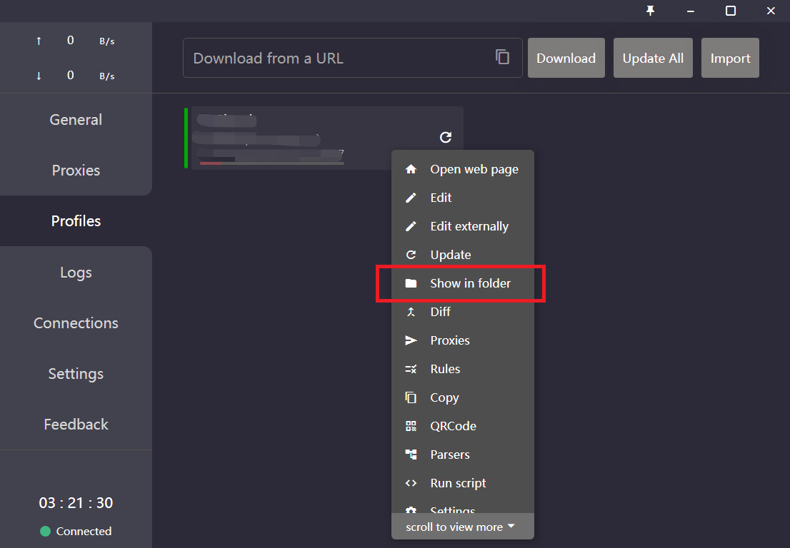
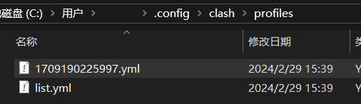
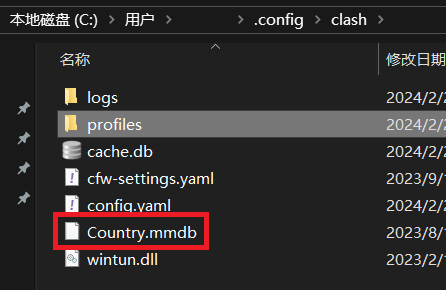
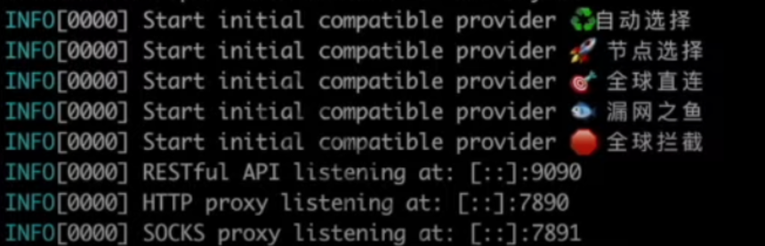

## 1.获取 clash 可执行文件

查看操作系统架构：

```shell
dpkg --print-architecture
// amd64

arch
// x86_64
```

根据系统架构下载对应的 clash for linux 核心文件：

[clash-linux-arm64-v1.18.0.gz](./assets/clash-linux-arm64-v1.18.0.gz)

[clash-linux-amd64-v1.13.0.gz](./assets/clash-linux-amd64-v1.13.0.gz)

```shell
# 进入文件所在目录
cd ~/Downloads
# 解压
gunzip clash-linux-arm64-v1.18.0.gz
# 重命名
mv clash-linux-arm64-v1.18.0 clash
# 添加可执行权限(解压后是一个可执行文件，如果没有执行权限，需要手动添加）
chmod +x clash
# 复制clash 到/usr/bin/文件夹(这样在终端任何位置执行 clash 即可启动)
sudo mv clash /usr/bin/
```

## 2.将 clash 添加到 systemctl

### 创建并编辑 clash.service文件

```shell
vi /etc/systemd/system/clash.service
```

### 粘贴以下内容

```shell
[Unit]
Description=clash
[Service]
Type=simple
ExecStart=/usr/bin/clash -f /root/.config/clash/config.yaml
[Install]
WantedBy=multi-user.target
Alias=clash.service
```

### 添加配置文件

创建 `/root/.config/clash/` 目录，并在该目录下添加 config.yaml 和 Conutry.mmdb 文件

**ps:**

如果没有手动添加配置文件，clash 会自动在这个目录下生成默认的配置文件

在运行clash时，使用 -f 指定配置文件，示例：*clash -f config.yaml* （运行clash并指定配置文件为./config.yaml）

#### 从 clash for windows 获取配置文件



将文件夹下的 `.yml` 文件重命名为 `config.yaml` 即可



在上一级目录可以找到 `Country.mmdb` 文件



### 运行 clash

```shell
# 依次执行如下命令(reload: 刷新守护进程, enable: 开启自启动, start: 启动, status: 查看状态)
systemctl daemon-reload
systemctl enable clash
systemctl start clash
systemctl status clash
```

### 需要注意：

1. 如果提示 Country.mmdb invalid (即Country.mmdb配置无效)，可下载示例文件替换：[Country.mmdb示例文件下载](https://cdn.hftech.ltd/download/clash/Country.mmdb)。
2. clash成功运行后，使用浏览器访问 [http://127.0.0.1:9090](http://127.0.0.1:9090/) 会出现 “hello clash”, 7890: http代理端口, 7891: socket代理端口
3. clash成功运行后，终端会打印以下信息：



## 3.配置系统代理

可以新建一个 shell 脚本更方便的开关代理，如 set_proxy.sh

```shell
# 添加环境变量(root权限)
cat>/etc/profile.d/clash.sh<<EOF
# 开启系统代理
function proxy_on() {
	export http_proxy=http://127.0.0.1:7890
	export https_proxy=http://127.0.0.1:7890
	export no_proxy=127.0.0.1,localhost
    	export HTTP_PROXY=http://127.0.0.1:7890
    	export HTTPS_PROXY=http://127.0.0.1:7890
 	export NO_PROXY=127.0.0.1,localhost
	echo -e "\033[32m[√] 已开启代理\033[0m"
}

# 关闭系统代理
function proxy_off(){
	unset http_proxy
	unset https_proxy
	unset no_proxy
  	unset HTTP_PROXY
	unset HTTPS_PROXY
	unset NO_PROXY
	echo -e "\033[31m[×] 已关闭代理\033[0m"
}
EOF

echo -e "请执行以下命令加载环境变量: source /etc/profile.d/clash.sh\n"
echo -e "请执行以下命令开启系统代理: proxy_on\n"
echo -e "若要临时关闭系统代理，请执行: proxy_off\n"
```

运行

```shell
sh ./set_proxy.sh
```


## 相关链接

> [Ubuntu 配置clash的四种方式 – 日拱一卒 (joeyne.cool)](https://www.joeyne.cool/http/proxy/ubuntu-安装clash并配置开机启动/#terminal)

> [clash-for-linux/start.sh at master · l123wx/clash-for-linux (github.com)](https://github.com/l123wx/clash-for-linux/blob/master/start.sh)

> [Systemd 入门教程：命令篇 - 阮一峰的网络日志 (ruanyifeng.com)](https://www.ruanyifeng.com/blog/2016/03/systemd-tutorial-commands.html)
